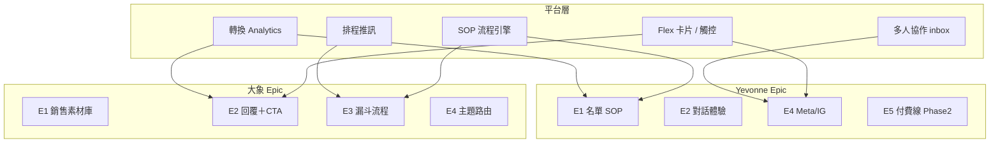

# MVP 回饋｜需求細項總表

所有細項可匯入 Linear／Jira。編號：`DX-###`（大象）、`YV-###`（Yevonne）。

| 客戶 | 細項文件 | 細項數 | P0 數 |
|------|----------|--------|-------|
| 大象醫師 | [需求細項_大象醫師.md](./2026_04_27_大象醫師/需求細項_大象醫師.md) | 30 | 18 |
| Yevonne | [需求細項_Yevonne老闆.md](./2026_04_29_Yevonne老闆（交友）/需求細項_Yevonne老闆.md) | 44 | 22 |

---

## P0 優先清單（跨客戶合併）

### 平台共用（先做底層）

| ID | 標題 | 客戶 | 模組 |
|----|------|------|------|
| DX-010 / YV-030 | Flex 卡片＋觸控區修正 | 兩者 | 訊息 |
| YV-031 | postback 去重 | Yevonne | 後端 |
| YV-001 | SOP 流程引擎（狀態機） | Yevonne | 核心 |
| DX-006 | 知識庫綁 CTA | 大象 | 後台 |

### 大象醫師 — 銷售閉環

| ID | 標題 |
|----|------|
| DX-001 | 保健品目錄匯入 |
| DX-002 | 線上課程目錄匯入 |
| DX-003 | 文章庫＋導購 tag |
| DX-004 | 看診／檢查服務項目 |
| DX-011 | 字數超限 → 文章 deep link |
| DX-012 | 單則回覆多 CTA 排序 |
| DX-013 | 非診斷類保健品建議模式 |
| DX-014 | 直接醫學問題護欄 |
| DX-020 | 文章優先策略 |
| DX-021 | 延遲主動追訊 |
| DX-022 | 追訊第二觸點模板 |
| DX-030 | 意圖分類：可售 vs 需看診 |
| DX-031 | 主題路由：多囊（Demo） |
| DX-034 | 一文章多問題匹配 |
| DX-040 | 多囊 Demo 腳本 |
| DX-041 | 銷售素材匯入協助 |

### Yevonne — 名單轉換

| ID | 標題 |
|----|------|
| YV-002 | Stage 0 開場（非個資） |
| YV-003 | Stage 1 需求探詢 |
| YV-004 | Stage 2 性別確認 |
| YV-005 | Stage 3 稱呼收集 |
| YV-006 | Stage 4 名單欄位卡片 |
| YV-007 | 資格篩選規則 |
| YV-009 | Step 流失偵測 |
| YV-010 | 流失 → 人工介入佇列 |
| YV-011 | 電話 = 轉換事件 |
| YV-020 | 情緒價值 Tone |
| YV-022 | 人工純手打通道 |
| YV-023 | AI／人工視覺不區分 |
| YV-033 | 電話格式驗證 |
| YV-060 | 電話轉換率 Dashboard |
| YV-061 | AI vs 人工報表 |
| YV-062 | 漏斗逐步轉換率 |
| YV-064 | 文字版需求確認書 |
| YV-065 | 現場 SOP 訪談 |

---

## Epic 對照（產品模組視角）

---

## 建議團隊分工（2 週一驗收節奏）

| 週次 | 大象交付 | Yevonne 交付 |
|------|----------|--------------|
| W1–2 | DX-001～004 素材＋DX-010～014 回覆 loop | YV-030～031 修卡片＋YV-001～006 SOP |
| W3–4 | DX-020～022 追訊＋DX-031 Demo | YV-020～023 情緒＋人工＋YV-060～062 報表 |
| W5–6 | DX-032 多主題 | YV-040 多人＋YV-064 需求確認書 |
| W7+ | DX-015 A/B 鋪路 | YV-043 IG 整合 Phase 2 |

---

## 快速統計

| 維度 | 大象 | Yevonne | 合計 |
|------|------|---------|------|
| 細項總數 | 30 | 44 | 74 |
| P0 | 18 | 22 | 40 |
| P1 | 9 | 17 | 26 |
| P2 | 3 | 5 | 8 |
