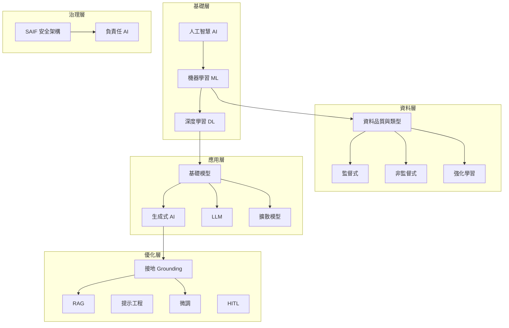

# 生成式 AI：瞭解基礎概念

> Google Skills · 生成式 AI 領袖學習路徑 · 基礎概念課程學習筆記

## Insight

AI、ML、生成式 AI 是**層級關係**（AI → ML → 生成式 AI），不是同義詞。傳統 AI 像「判斷畫作好壞」，生成式 AI 像「拿畫筆創作新畫」。資料品質與類型決定模型上限；訓練方式（監督／非監督／強化）取決於任務與可用資料。深度學習催生**基礎模型**，再透過 RAG、提示工程、微調、接地與 HITL 克服幻覺與偏誤；最後，**安全（SAIF）是負責任 AI 的地基**——沒有資安，再精美的 AI 應用都有風險。

## Input

- **來源**：Google Skills ·「生成式 AI：瞭解基礎概念」
- **附件**：[`assets/生成式 AI：瞭解基礎概念.pdf`](assets/生成式 AI：瞭解基礎概念.pdf)
- **內容摘要**：
  - 模組一：AI / ML / 生成式 AI 定義與層級、資料角色、三大學習類型、ML 生命週期與 Google Cloud 工具
  - 模組二：深度學習、基礎模型、LLM / 擴散模型、模型選擇、限制克服（接地 / RAG / 提示 / 微調 / HITL）
  - 模組三：安全 AI（SAIF、資料中毒）、負責任 AI（透明、隱私、公平、可解釋）
  - 測驗：核心概念測驗 1～3

## Translation

| 原文 / 課程說法 | 我的理解 |
|----------------|----------|
| AI 是廣泛領域，ML 是方法，生成式 AI 是應用。 | 談 AI 時要先問「是哪一層」——講聊天機器人其實是在講生成式 AI，背後還有 ML 與資料工程。 |
| 傳統 AI 判斷、生成式 AI 創造。 | 垃圾郵件分類是「對已有東西下判斷」；Gemini 寫文案是「產出原本不存在的內容」——商業場景選錯類型會期待錯誤。 |
| 資料品質五要素 + 可存取性。 | 模型再強，餵錯資料就像用過期溫度預測牛奶變質——準確、完整、代表、一致、相關，缺一不可。 |
| 接地 vs RAG vs 微調。 | 接地是目標（讓輸出有依據）；RAG 是「先查資料庫再回答」；微調是「把模型本身訓練成某領域專家」——快→慢、通用→專用。 |
| 安全是負責任 AI 的地基。 | 先防資料中毒、權限外洩，再談公平與透明——房子地基不穩，裝潢再好也會倒。 |

## Why

| 以前覺得 | 現在覺得 |
|----------|----------|
| AI、機器學習、生成式 AI 差不多是同一件事。 | 有明確層級：AI（目標）→ ML（從資料學）→ 生成式 AI（創造新內容）。 |
| 導入 AI 主要是選模型、寫提示詞。 | 資料策略（品質、結構化/非結構化、標籤）與生命週期管理（收集→部署→監控）同樣關鍵。 |
| 幻覺只能靠「叫模型小心一點」解決。 | 要系統性用接地、RAG、微調、HITL 組合；單一技巧通常不夠。 |
| 倫理與安全是上線後才補的議題。 | 從收集資料、訓練、部署各階段就要嵌入 SAIF 與負責任 AI 四維度。 |

## Action

- [ ] 用 30 秒向同事解釋 AI → ML → 生成式 AI 層級（驗證是否真的吸收）
- [ ] 盤點我們一項 AI 任務的資料：是否具備品質五要素？結構化/非結構化各佔多少？
- [ ] 對照 ML 生命週期，標出我們目前卡在哪一階段（收集、準備、訓練、部署、管理）
- [ ] 選一個會幻覺的場景，試設計 RAG 流程（外部知識庫 + 引文）vs 僅提示工程，比較差異
- [ ] 閱讀 [Google SAIF](https://saif.google/)，對照我們專案是否涵蓋資料存取控管與模型訓練期防護

## Question

- 我們的業務資料以結構化還是非結構化為主？哪一類最難補齊「代表性」？
- 監督式 vs 非監督式：現有痛點更適合「有標準答案的預測」還是「挖隱藏分群」？
- 微調 vs RAG：什麼時候值得花成本微調，什麼時候 RAG + 提示就夠？
- 貸款/招募等高風險場景，我們的 HITL 與偏誤審核節奏是否足夠？

---

## 重點整理

### 模組一：AI、機器學習與資料基礎

#### 1. AI、ML、生成式 AI 的定義與層級

| 層級 | 英文 | 定義 | 重點 |
|------|------|------|------|
| 人工智慧 | AI | 打造能執行「通常需要人類智慧才能完成工作」的機器 | 廣泛科學領域：學習、解決問題、做決定 |
| 機器學習 | ML | AI 的子領域；用大量資料訓練模型，從資料自行學習 | 本質像一組複雜的數學方程式／聯立方程式 |
| 生成式 AI | Generative AI | ML 的分支應用；利用學到的模式**創造新內容** | 文字、圖片、音樂、影片等 |

**層級關係**

```
AI（機器像人一樣思考）
  └── ML（從資料中學習方程式）
        └── 生成式 AI（用學到的模式創造新內容）
```

**傳統 AI vs 生成式 AI（教小朋友畫畫比喻）**

| 類型 | 比喻 | 行為 | 範例 |
|------|------|------|------|
| **傳統 AI**（分析／預測） | 給孩子看一幅好畫，教他判斷特徵 | 根據既定規則**判斷** | 垃圾郵件分類 |
| **生成式 AI**（創造） | 看過千萬幅畫後，給畫筆讓他**創作** | 產出**全新且獨特**的內容 | 生成圖片、文字、音樂 |

---

#### 2. 資料在 AI 與機器學習中的角色

**運作原理**

- ML 模型透過分析現有資料找出模式，收到新資訊時用**機率**預測結果（類似人依過去經驗猜測）。
- 必須使用與任務**高度相關**的資料——預測牛奶變質需要日期與溫度，不是廣播歌曲。

**資料品質五大要素**

| 要素 | 英文 | 說明 |
|------|------|------|
| 準確率 | Accuracy | 資料不準 → 模型學到錯誤模式 → 錯誤預測 |
| 完整度 | Completeness | |
| 代表性 | Representativeness | |
| 一致性 | Consistency | 格式與標籤不一致會混淆模型、阻礙學習 |
| 關聯性 | Relevance | |

**補充：資料可存取性**

- AI 能否有效運用資料，取決於可用性、費用與格式。
- 缺乏可存取性會限制學習能力並增加潛在偏誤。

**結構化 vs 非結構化資料（Cymbal 清潔公司範例）**

| 資料類型 | 定義與特色 | Cymbal 範例 |
|----------|------------|-------------|
| **結構化** | 預先定義結構，整齊排列在資料表中，易搜尋整理 | 客戶 ID、名稱、購買日期、訂單費用、1～5 星評分 |
| **非結構化** | 無預定義結構，難整理成行列，需較複雜分析 | 自由文字評論、產品圖片、電子郵件內容 |

> **總結**：資料是所有 AI 的基礎；成功推動 AI 計畫需掌握類型、品質五要素與可存取性。

---

#### 3. 三大機器學習學習類型

**資料基本分類**

| 類型 | 說明 |
|------|------|
| **標籤資料** (Labeled) | 附帶明確標記、標籤或正確答案 |
| **無標籤資料** (Unlabeled) | 演算法自行探索模式（如未整理相片集、未分類流量記錄） |

**三大訓練方式**

| 類型 | 核心機制 | 應用實例 | Google Cloud 範例 |
|------|----------|----------|-------------------|
| **監督式學習** | 用標籤資料學習輸入→輸出對應 | 郵件分類為垃圾／非垃圾 | Vertex AI 預測性維護 |
| **非監督式學習** | 無標籤資料中自行找規律、群組 | 新聞主題模型；顧客隱藏區隔 | BigQuery ML 異常偵測 |
| **強化學習** | 與環境互動，依獎勵／懲罰學習 | 機器人走迷宮；自駕車；電玩 AI | Vertex AI 產品推薦（依行為持續調整） |

> **總結**：採用哪種訓練方法，完全取決於**任務本質**與**可用資料類型**。

---

#### 4. Google Cloud 與機器學習生命週期

**ML 生命週期五大階段**

1. 收集資料
2. 準備資料
3. 訓練模型
4. 部署及預測
5. **管理模型**（部署後維護至關重要）

**模型管理重點**

| 功能 | 工具／做法 |
|------|------------|
| 版本管理 | 追蹤不同版本模型 |
| 成效追蹤 | 查看模型指標 |
| 監控偏移 | 注意準確度是否隨時間變化 |
| 資料管理 | Vertex AI Feature Store |
| 集中儲存 | Vertex AI Model Garden |
| 自動化流程 | Vertex AI Pipelines |

**基礎架構與安全**

- **穩定性**：Google Cloud 基礎架構確保高可用與可靠。
- **安全性**：IAM 嚴格控管敏感資料存取。

> **總結**：Vertex AI（訓練／部署）+ 資料工具（擷取／準備／管理）= 企業 ML 全方位支援。

---

#### 5. 測驗 1：核心概念（6 題精華）

| # | 觀念 | 正確理解 |
|---|------|----------|
| 1 | **模型**定義 | 複雜的**數學結構**，處理輸入產生輸出（非單純規則或硬體） |
| 2 | **資料導入與準備**目的 | 收集、清理、轉換原始資料 |
| 3 | **一致性**影響 | 不一致的格式與標籤會混淆模型、阻礙學習 |
| 4 | **ML 生命週期順序** | 資料導入與準備 → 模型訓練 → 模型部署 → 模型管理 |
| 5 | **非結構化資料**範例 | 自由文字形式的客戶評論（薪資表、試算表為結構化） |
| 6 | **強化學習**方式 | 代理人透過與環境互動、接收獎勵／懲罰回饋來學習 |

---

### 模組二：深度學習、基礎模型與生成式 AI

#### 6. 深度學習、基礎模型與生成式 AI 的關聯

| 技術 | 定位 | 特色 |
|------|------|------|
| **深度學習 (DL)** | ML 的強大分支 | 人工類神經網路；處理極複雜模式；常採半監督式（少量標籤 + 大量無標籤） |
| **基礎模型 (Foundation Models)** | 建立在 DL 之上 | 龐大資料集大規模訓練；廣泛理解、多任務能力（比喻：讀遍整座圖書館的學生） |
| **生成式 AI** | 應用層 | 將基礎模型 + DL 用於創作全新原創內容 |

**兩大主要基礎模型類型**

| 類型 | 專長 | 應用 |
|------|------|------|
| **大型語言模型 (LLM)** | 理解與生成人類語言 | 翻譯、創作、問答；Gemini、現代搜尋引擎 |
| **擴散模型 (Diffusion)** | 將雜訊逐步轉為結構化資料 | 高品質圖片、音訊、影片生成 |

**三層定義複習**

| 術語 | 一句話定義 |
|------|------------|
| AI | 打造能執行人類智慧工作的機器之電腦科學領域 |
| ML | 讓機器從資料自我學習、隨時間提升，無需明確程式指示 |
| DL | 運用多層類神經網路分析複雜資料模式的 ML 分支 |

---

#### 7. 如何選擇生成式 AI 模型

**評估模型的 8 大關鍵要素**

1. **模態**（文字、圖片、音訊、影片）
2. **脈絡窗口**（一次能處理的資料量上限）
3. **安全性**（風格控管、隱私、機密）
4. 可用性與穩定性
5. 費用
6. 效能
7. 微調與自訂
8. 輕鬆整合

**Google Cloud 四款核心基礎模型（Vertex AI）**

| 模型 | 類型 | 適用場景 |
|------|------|----------|
| **Gemini** | 多模態 | 跨格式理解與生成；進階對話、內容創作、細微問答 |
| **Gemma** | 輕量開放式 | 本地部署、可自訂的專用 AI 應用 |
| **Imagen** | 文字轉圖像擴散 | 創意設計、電商視覺化、內容創作 |
| **Veo** | 影片生成 | 電影、廣告、線上影音（文字或靜態圖 → 動態影片） |

**企業應用四大效益**

- 提升顧客體驗（智慧聊天、個人化內容）
- 提高工作效率（自動化繁瑣工作、資訊檢索）
- 促進創新（新靈感、新設計、創意流程）
- 改善決策品質（從海量資料快速取得洞察）

---

#### 8. 克服基礎模型限制

**基礎模型 6 大先天限制**

資料依附性、知識截點、偏誤、公平性問題、幻覺（捏造內容）、極端案例

**4 大關鍵優化技術**

| 技術 | 核心概念 | 說明 |
|------|----------|------|
| **建立基準 (Grounding)** | 將輸出連結至可驗證真實資訊 | 減少幻覺；可提供引文與信心分數 |
| **RAG** | 基準化的常見實作 | 先從外部知識庫檢索 → 擴增提示 → LLM 生成回覆 |
| **提示工程** | 最快直接 | 精心設計提示引導輸出；仍受限於模型既有知識 |
| **微調 (Fine-tuning)** | 特定領域再訓練 | 用新資料集調整參數；特定風格、語言、格式表現更佳 |

**人機迴圈 (HITL, Human-in-the-Loop)**

- 需要判斷力、複雜脈絡或不完整資料時，人類專業知識不可或缺。
- 常見於：內容審核、敏感應用、高風險決策、生成前後審查。

**三者關係**

```
建立基準（Grounding）= 整體目標（提高準確度與可靠性）
  ├── RAG = 透過外部知識實現基準化
  └── 微調 = 透過特定資料強化領域基準能力
```

---

#### 9. 測驗 2：基礎模型（6 題精華）

| # | 觀念 | 正確理解 |
|---|------|----------|
| 1 | **微調**價值 | 調整模型適應特定任務或領域，滿足客製化業務需求 |
| 2 | **HITL**角色 | 融入人類專業知識，非為全面取代技術 |
| 3 | **建立基準**目的 | 將 AI 輸出連結可驗證資訊來源，減少幻覺 |
| 4 | 克服限制需綜合運用 | 接地 + 提示工程 + 微調 + HITL（非僅升級硬體） |
| 5 | **LLM**定義 | 專門理解與生成人類語言的基礎模型 |
| 6 | **擴散模型**專長 | 根據文字描述產生逼真圖像（文字轉圖像） |

---

### 模組三：安全且負責任的 AI

#### 10. 安全 AI (Secure AI)

**核心定義**

- 防止 AI 應用遭受蓄意攻擊，保護從開發到部署的整個生命週期（資料、基礎架構、部署位置）。
- **不造成傷害**（隱私、防錯誤資訊、公平道德）+ **不受到傷害**（抵禦外部威脅）。

**關鍵威脅：資料中毒 (Data Poisoning)**

| 項目 | 內容 |
|------|------|
| 階段 | ML 生命週期「收集資料」階段 |
| 機制 | 導入經竄改的惡意資料破壞訓練集 |
| 後果 | 模型學到錯誤模式 → 偏誤、不準確、有害預測 |
| 防範 | 嚴格存取控管：限制誰能存取、新增、輸入訓練資料 |

**Google 安全 AI 架構 (SAIF)**

- 與企業現有安全防護無縫整合，AI 模型預設採安全設定。
- 三大功能：找出並阻止威脅、自動強化防禦、管理各 AI 系統獨特風險。

**Google Cloud 安全工具**

| 工具 | 用途 |
|------|------|
| 基礎安全防護 | 全球網路、硬體安全、傳輸中／靜態加密 |
| IAM | 控管雲端資源與 AI 資料存取權限 |
| Security Command Center | 集中掌握安全狀態與潛在威脅 |

> **總結**：資料中毒、模型竊取、提示注入等新風險，需以 SAIF + 雲端資安工具奠定安全基礎。

---

#### 11. 負責任 AI (Responsible AI)

**核心比喻：安全是地基**

- 資安不穩 → 再精美的 AI 設計都有風險。
- 健全資安是打造可信賴、負責任 AI 的**核心基礎**。

**負責任 AI 四大維度**

| 維度 | 英文 | 重點 |
|------|------|------|
| 公開透明 | Transparency | 使用者知情權；明確告知 AI 運作與使用須知 |
| AI 時代隱私 | Privacy | 妥善、安全、負責任處理資料 |
| 資料品質、偏誤與公平性 | Fairness | 訓練資料有社會偏誤 → AI 延續並擴大歧視 |
| 問責與可解釋性 | Explainability | 決策過程公開透明、易被人類理解 |

**法律規範趨勢（需持續諮詢法律）**

- 資料隱私權、不歧視原則、智慧財產權 (IP)、產品責任與授權協議

**自我測驗觀念**

- 資料品質差 → 偏誤與歧視結果。
- 可解釋 AI → 讓複雜決策變得透明易懂。
- AI 偏誤來源 → 開發者偏誤，或訓練／部署環境中的偏誤。

> **系列閉幕總結**：負責任 AI 須貫穿生命週期每階段；掌握 AI/ML/生成式 AI 差異、資料策略、基礎模型限制克服後，設下適當防護，AI 才能真正造福社會。

---

#### 12. 測驗 3：安全且負責任的 AI（5 題精華）

| # | 觀念 | 正確理解 |
|---|------|----------|
| 1 | 不準確／不完整數據 | 導致偏差與不公平（引入或放大偏見） |
| 2 | **SAIF**目標 | 為負責任建構與部署 AI 建立安全標準，應對 AI 獨特威脅 |
| 3 | 貸款評估負責任做法 | ① 多元資料訓練（不同人口統計背景）② 定期審核模型效能、減輕隨時間出現的偏差 |
| 4 | 倫理開發首要目標 | 確保 AI 負責任使用、**不造成傷害** |
| 5 | **模型訓練**階段資安 | 保護訓練資料與模型參數免受未經授權存取 |

---

## 概念地圖（全課程一覽）



---

## 延伸資源

- [Google 安全 AI 架構 (SAIF)](https://saif.google/)
- Vertex AI · Model Garden · Feature Store · Pipelines
- 相關課程：[`生成式 AI：不只是聊天機器人`](../生成式%20AI：不只是聊天機器人/README.md)

---

## 更新紀錄

- 2026-05-29：建立初版（整合 PDF、網頁重點與測驗 1～3）
