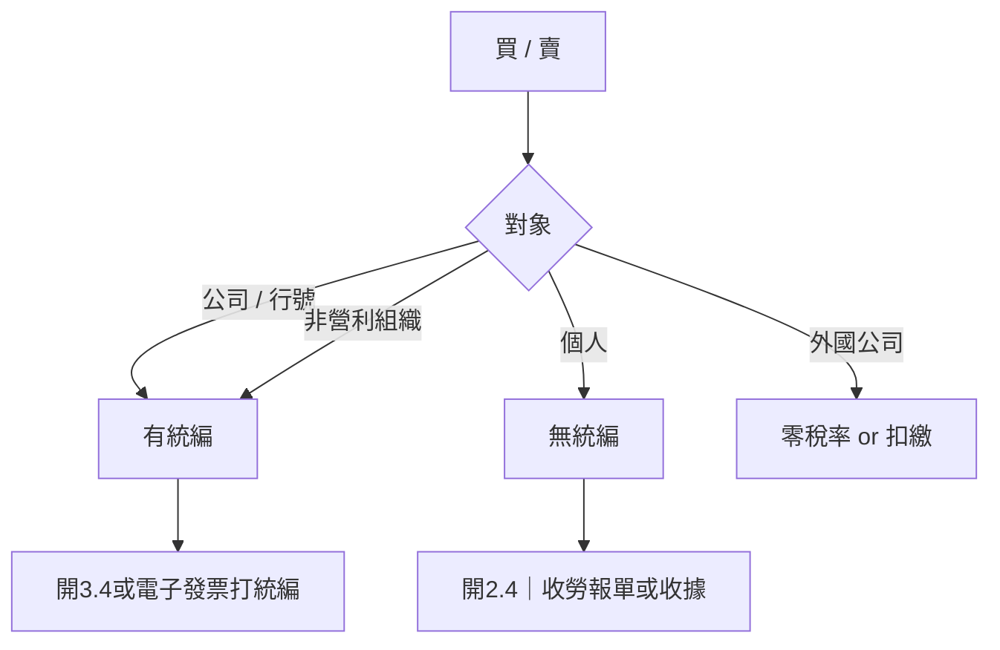

# 公司設立與租稅實務

建立者: XiaoYun Xu
建立時間: 2025年10月23日 下午12:58
類型: 十堂線上課程
最後編輯者: XiaoYun Xu
最後更新時間: 2025年12月30日 下午4:37
狀態: 完成
講師: Simpany 簡單開公司

## 第一章：從個人到公司

### 🧾 **簡單開公司｜從登記到結稅的財稅白話文**

## 🎯 **課程目的 / Key Takeaways**

- 讓創業者以 **最簡單的方式理解公司設立與稅務制度**
- 幫助創業者搞懂 **從個人到公司的三個階段 & 每個階段的必備知識**
- 避免因不了解流程或報稅制度而產生罰款與營運風險
- 建立創業者 **合法節稅、掌握財務、有效營運** 的能力

---

## 🧠 **整體課程架構（導覽）**

### **🔹 從個人到公司的三階段**

| 階段 | 名稱 | 內容重點 | 本課章節位置 |
| --- | --- | --- | --- |
| **第 1 階段** | 公司成立前（籌備期） | 是否需要登記？營業稅起徵點？個人 / 航號 / 公司怎麼選？合法經營要件 | 章節 2 |
| **第 2 階段** | 公司成立（設立流程） | 名稱預查、資本額、登記地址、負責人勞健保影響 | 章節 2 |
| **第 3 階段** | 成立後（營運期） | 營業稅 / 營所稅、報稅原則、結稅策略、單據管理 | 章節 3 – 5 |

---

## 📍 **公司設立前，一定要先搞懂：**

| 主題 | 重點摘要 |
| --- | --- |
| 做生意需不需要登記？ | 依營業稅法：有銷售行為者需在開始營業前登記 |
| 可以免登記的情況？ | 若營業額 **每月未達起徵點**（金額後面課程會說） |
| 不登記的風險 | 罰款：**1–5 萬元** + 補稅與滯納金 |
| 組織型態怎麼選？ | 個人、行號、公司：依營收規模、風險承擔、未來規劃決定 |

---

## 📍 **設立公司時的關鍵選項**

| 項目 | 決策點 |
| --- | --- |
| 組織型態 | 公司 / 行號 |
| 公司名稱 | 名稱預查一次過 |
| 資本額 | 非越大越好，會影響勞健保與成本 |
| 登記地址 | 自宅、租用地址、或地址掛靠 |
| 其他 | 負責人勞健保費率與權益差異 |

---

## 🧾 **章節導覽**

| 想解決的問題 | 從哪一章開始？ |
| --- | --- |
| 我還不確定要不要成立公司 | 章節 2：登記前的判斷 |
| 我已經要登記了，需要流程 | 章節 2：設立詳細流程 |
| 我已經是負責人，要理解稅務 | 章節 3–5：營業稅、營所稅、結稅與報表 |

---

## 💬 **講師金句 / Insight**

> 「讓財稅知識成為你的創業優勢，而不是障礙。」
> 

> 「創業不是一條輕鬆的路，但有正確知識就能少走很多冤枉路。」
> 

---

## 🧩 **Cloudia 下一步行動（建議）**

- [ ]  釐清目前階段：是否需要進入登記流程？
- [ ]  做一次組織型態評估：個人 / 行號 / 公司
- [ ]  準備問題清單：本課想得到哪些具體答案？
- [ ]  記錄財稅盲點與需要協作的項目（會計、法務）

---

## 📎 相關資源

- 營業稅法 § 開業登記
- 商業登記法 § 起徵點與罰則

---

### ✨ 完成本單元

📍 下一單元請貼上：**章節 2：公司成立前，你需要知道什麼？**

準備好後直接貼第二段逐字稿，我會用相同格式整理。

等你下一段 🙌

### 💰 **開公司要花多少錢？成本結構與稅務開銷解析**

## 🎯 **本單元學習目標**

- 了解開公司涉及的 **一次性成本 + 週期性成本**
- 掌握 **每月/每年需要支付的項目**
- 認識 **稅務結構、報稅時機與額外費用**
- 避免因不理解成本構成而造成預算錯估

---

## 🧾 **開公司總成本分為兩大類**

.png)

| 類型 | 說明 | 常見項目 |
| --- | --- | --- |
| **一次性費用（設立成本）** | 成立公司或行號時需支付 | 行政規費、申請費、代辦費、工商憑證等 |
| **週期性費用（固定開銷）** | 公司日常營運持續支出 | 租金、登記地址、記帳費、稅、二代健保、扣繳 |

---

## 🟦 **一次性設定費用**

| 設立方式 | 行號 | 公司 |
| --- | --- | --- |
| **自行辦理** | 程序繁瑣、風險需自負 | 程序繁瑣、需熟悉規範 |
| **委託事務所** | **約 NT$6,000** | **NT$8,500～12,000** |

---

## 🟩 **週期性成本：公司營運固定支出**


### 1️⃣ **辦公室租金 / 店面租金**

- 需簽署 **自然人租約**
- 租金 **超過 NT$20,000 / 月** ➜ 需處理：
    - **2.11% 二代健保補充保費**（代扣代繳）
    - **10% 個人所得稅扣繳**
- 這兩項均由承租方（公司）負責扣繳並繳交政府

---

### 2️⃣ **登記地址費用**


| 登記位置 | 缺點 / 注意事項 | 可能成本 |
| --- | --- | --- |
| **自宅/親友住宅** | 稅目變更為「營業用」🏠｜房屋稅、地價稅提升 | 可申請 **1/6比例營業用**減少稅額 |
| **租用辦公室** | 房東稅增加可能由你負擔，需事先溝通 | 視租金而定 |
| **商務中心 / 地址掛靠** | 只使用地址不一定含座位 | **台北約 NT$2,500–3,500 / 月** |

> 建議：登記前與房東確認是否會增加稅負 & 是否需由你承擔
> 

---

### 3️⃣ **記帳與報稅費用**

.png)

| 類別 | 年費範圍（估） | 說明 |
| --- | --- | --- |
| **行號** | NT$ 2,600 – 3,500 | 若業務多可能增加 |
| **公司** | NT$ 2,800 – 3,500 以上 | 依發票量 & 公司規模調整 |

> 建議：營運初期仍建議委託記帳事務所，讓創辦人將時間用在營收成長上
> 

---

## 🟥 **稅務相關成本**


| 類型 | 說明 | 報稅頻率 |
| --- | --- | --- |
| **營業稅（VAT）** | 一般稅額標準 **5%** | 每 2 個月申報一次 |
| **小規模營業人** | 統一稅率 **1%～2%** | 每 3 個月申報一次 |
| **營所稅（公司所得稅）** | 每年申報一次 | 5 月 |
| **暫繳（預付營所稅）** | 上半年獲利良好需先繳 50% | 11 月（依情況可申請免暫繳） |
| **股利分配** | 可能產生 **2.11% 二代健保補充保費** | 依分配時間 |
| **扣繳稅款** | 外包人員成本需代扣10%、租金扣繳10% | 每次付款即執行 |
| **二代健保補充保費** | 非薪資所得需加收 2.11% | 外包費、租金、股利 |

---

## 📍 **暫繳稅說明（重點）**

.png)


> 公司當年度營所稅若較高，11 月需預繳 50% 稅額作為暫繳
> 

📌 例：年度營所稅 NT$32,000

→ 暫繳 50% = NT$16,000

→ 次年真正結算稅額後再多退少補

行號沒有營所稅 → **免暫繳**

---

## 🟨 **3️⃣ 股利分配（Dividend Distribution）**


> 公司賺錢後，是否要把盈餘分配給股東？
> 

| 項目 | 說明 |
| --- | --- |
| 分配後產生的所得 | 股東 → 收到 **股利所得** |
| 稅務對象 | 股東個人要申報所得稅 |
| 可能觸發的額外成本 | **二代健保補充保費 2.11%** |
| 若平均分配後收入高於投保薪資 | ➜ **需調整健保費級距** |
| 若平均後收入低於原本投保薪資 | ➜ **不調整級距** |

📌 **可以選擇不分配盈餘** → 不產生任何上述成本

📌 股利分配可能因 **可扣抵稅額 8.5%** → 出現 **退稅**

> ▶️ 詳細策略會在課程「稅務實務」單元深入介紹
> 
> 
> 何時該分？怎麼分最有利？
> 

---

## 🟨 **4️⃣ 扣繳（Withholding Tax）**

.png)


.png)

.png)

.png)

> 公司在支付款項給個人時，政府要求先代扣部分稅款
> 

| 付款對象 / 類型 | 須代扣？ | 扣繳率 | 備註 |
| --- | --- | --- | --- |
| 外包、講師、自由工作者收入 | ✔ | **10%** | 所得大於扣繳免繳額時 |
| 房東租金（每月 >20,000） | ✔ | **10%** | 另需代扣二代健保補充保費 |
| 勞健保 | ✔（勞保、健保由薪資扣） | 按健保級距 | 員工薪資費用 |
| 外幣投資、利息等特殊收入 | 視情況 | 不同稅率 | 依法規定 |

---


---

## ⭐ **講師金句**

> 「股利分配不是一定要做，而是要選對時機做。」
> 
> 
> **「分配得好可以退稅，分配不好會被補二代健保。」**
> 

---

## 🧩 Cloudia 下一步建議

- [ ]  製作 **股利分配模擬表**（不同金額、不同投保薪資）
- [ ]  與會計師確認 **今年需不需要暫繳 or 是否推薦分配**
- [ ]  可以把這部分設計進 **Pitch Deck 財務策略頁**，展示財務思維

---

### ✔️ 已將【股利分配】完整補齊

如果你要，我可以幫你：

- 做 **可試算的 Google Sheet 模板**（投入數字自動計算二代健保 & 稅差）
- 幫你寫 **Pitch Deck：財務策略 &股利政策**一頁

要一起做 Google Sheet 嗎？

👉 回我：「做試算表」 我會直接幫你做（含自動公式）

---

## 💬 **講師金句**

> 「讓財稅知識成為你的創業優勢。」
> 

---

## 🧩 **Cloudia 可行動項目**

- [ ]  製作自己的成本試算表（一次性 / 每月 / 每年）
- [ ]  決定登記地址方案：自宅 / 商務中心 / 辦公室
- [ ]  預估營所稅暫繳情境（依營收曲線）
- [ ]  決策是否委託記帳事務所

---

## 📎 附加工具建議

| 目的 | 推薦工具 |
| --- | --- |
| 記帳與報稅 | 記帳事務所、會計師 |
| 公司設立代辦 | 簡單開公司 |
| 成本試算 | Notion Sheet / Google Sheet |

## 第 2 章 - 公司登記：設立前要知道的眉角

### 🧾 **什麼時候需要成立公司或行號？**

## 🎯 **本單元學習重點**

- 什麼時候需要成立公司或行號？
- 規模門檻：三階段營收量級
- 小規模營業人是什麼？何時可申請？
- 行號 vs 公司 — 適用情境與關鍵差異
- 實務申請時常見的限制與審核方式

---

## 🟦 **何時必須成立公司或行號？**


📌 **關鍵門檻：營業稅起徵點（月營收）**

| 銷售額級距（月營收） | 組織建議與規定 |
| --- | --- |
| **低於起徵點** （貨物未滿 8 萬 / 服務未滿 4 萬） | 可用 **個人名義收款**，**免辦登記**、免營業稅 |
| **起徵點 ～ 20 萬之間** | **必須辦理稅籍登記** ➜ 開行號或公司可申請成為 **小規模營業人**（免開發票） |
| **超過 20 萬** | **必須成立公司或開立發票的行號** |

---

### 📍 補充：登記 vs 開發票是兩件事

.png)

| 行為 | 觸發條件 |
| --- | --- |
| **辦理稅籍登記** | 月營收達起徵點（一次達標也需登記） |
| **使用統一發票** | 平均月營收達 20 萬，依最近 6 個月平均 |

🔁 例：某月 8 萬，其餘 5 個月皆低於 8 萬 → **需登記，但暫時不用開發票** → 可申請小規模

---

## 🟩 **營業稅起徵點標準**

.png)

| 商品類型 | 未達起徵點標準 | 說明 |
| --- | --- | --- |
| **貨物買賣** | 8 萬／月 | 商品、電商、網拍等 |
| **勞務提供** | 4 萬／月 | 顧問、課程、設計、健身教練等 |

---

## 🟨 **小規模營業人（免開統一發票的行號）**

> 📍 適合月營收不到 20 萬、營運規模較小的店家或賣家
> 

.png)

.png)

### ✔ 小規模營業人優點

| 內容 | 說明 |
| --- | --- |
| **不用開發票** | 以「繳費單」方式繳營業稅 |
| **營業稅低** | 約 **1%**（依核定營收） |
| **申報流程簡單** | 每 3 個月一次繳費，不需記帳報表 |
| **節省記帳成本** | 初期創業優勢大 |

📌 例：核定月營收 10 萬

營業稅＝10 萬 × 1% = **1,000/月**

每 3 個月繳費一次 → **3,000**

---

### ❗ 小規模營業人申請需注意條件


| 要點 | 說明 |
| --- | --- |
| 登記地址 | **不能與開發票的行號或公司同址**（除非各自獨立門牌） |
| 營業項目數量 | 建議 **3–5 項內** |
| 資本額 | **1～5 萬最佳，不建議超過 10 萬** |
| 產業特性 | 不含高價或大型設備、非高單價服務 |
| 實地勘查 | 稅務員會到現場依坪數/租金/客單價推估營業額 |

.png)


🔍 比較容易申請成功：

小吃店、飲料店、小型零售、手作、微型沙龍、低單價服務

🔍 较不易核准：

健身房、工程、設計、行銷、顧問、成本高的品牌

---

## 🟥 **公司 vs 行號：定位差異**

.png)

.png)

.png)

|  | 行號 | 公司 |
| --- | --- | --- |
| 法律身分 | 代表人個人延伸 | **獨立法人個體** |
| 責任承擔 | **無限責任**（需以個人財產負責） | **有限責任**（以出資額為限） |
| 名稱保護範圍 | 只限登記縣市 | 全國 |
| 稅務制度 | 融入個人綜所稅 | 公司營所稅 + 個人股利所得 |
| 組織彈性 | 可獨資或合夥 | 有限／股份有限公司可彈性股權配置 |
| 適用情境 | 小型買賣／自由工作者／微型店家 | 需擴張、需募資、分潤、法人合作需求 |


📌 **行號與公司無法互轉**

行號 → ✖ 無法轉公司

公司 → ✔ 可轉股份有限公司

---

## 📍 **成立公司的建議時機**


| 年營收 | 建議 |
| --- | --- |
| **低於 100 萬** | 不一定需要成立公司，評估行號或小規模即可 |
| **超過 100 萬** | 開公司較有利：稅負、形象、合作與責任風險 |

.png)


---

## 💬 講師金句

> ✨ 營業額決定形式，未來規模決定組織。
> 

---

## 🧩 Cloudia 行動建議

- [ ]  依目前 Business Model 預估 6 個月平均營收曲線
- [ ]  決定適合的組織型態：小規模 / 行號 / 有限公司 / 股份有限公司
- [ ]  準備 Notion 自己的判斷表格（我可以幫你做）
- [ ]  若要申請小規模 → 準備地址、營業項目、營收證明

---

## 📎 常見問題可以再補充的（之後章節會提）

- 小規模可否轉公司？（可以）
- 是否先小規模再轉開發票行號？
- 公司 vs 行號：稅負模擬 & 實際差異案例

### 🧾 **公司 vs 行號怎麼選？五大判斷面向**

## 🏷 **公司 vs 行號 — 核心差異**

|  | **行號** | **公司** |
| --- | --- | --- |
| 法律定位 | 個人延伸 | **法人個體（獨立）** |
| 責任承擔 | **無限連帶責任** | **有限責任（以資本額為限）** |
| 名稱保護 | 只限登記縣市 | 全國 |
| 稅務方式 | 直接併入個人綜所稅 | 公司營所稅 + 可選擇分不分股利 |
| 健保級距 | 隨所得提升 | 分配方式有彈性 |
| 轉換彈性 | ✖ 不可轉公司 | ✔ 可升級為股份有限公司 |
| 品牌形象 & 融資 | 普通 | **較具公信力，有利申請貸款/表案** |
| 商標 | 可申請 | 可申請 |

---

## 🧠 **五大選擇面向**

### **1️⃣ 風險大小與責任承擔**


| 行業風險 | 建議 |
| --- | --- |
| **大型活動、承攬案、場地、體驗活動、食品、安全問題可能** | ➜ **成立公司**（有限責任、防火牆） |
| **設計、顧問、行銷、網拍、小型線上服務** | ➜ 公司 / 行號 **皆可** |
| **有高額個人資產不想暴露風險** | ➜ **成立公司** |

📍 **金句**：

> 「行號遇事賠到個人，有限公司最多賠到破產。」
> 

---

### **2️⃣ 營業額成長曲線**


| 產業型態 | 建議 |
| --- | --- |
| **暴衝型（產品爆量、使用者快速成長）** | 選公司（彈性較大） |
| **平緩型（服務/工時制/案子型）** | 行號即可 |

✏ 若行號營收突然暴增 → 個人綜所稅可能直接跳到高級距

---

### **3️⃣ 個人綜合所得級距**

| 個人綜所稅級距 | 建議 |
| --- | --- |
| **12% 以上** | ➜ **成立公司較有彈性** |
| **不滿 12%** | ➜ 行號可能比較省稅 |

.png)

📍 公司可選擇 **不分配股利**，延後納稅

📍 行號全額併入個人所得 → 稅可能瞬間拉高

---

### **4️⃣ 地域擴張需求 / 品牌定位**


| 情況 | 建議 |
| --- | --- |
| 單一縣市、小規模、微型商業 | 行號 |
| 跨縣市、加盟、品牌化、長期佈局 | **公司更適合** |

---

### **5️⃣ 產業規範與資格要求**

某些產業 **依法只能由公司經營**：

- 就業服務業
- 公共遊樂業
- 包租代管
- 醫療器材
- 若需政府補助 / 標案 / 融資

---

## 🧩 **快速決策矩陣**

| 指標 | 行號適合 | 公司適合 |
| --- | --- | --- |
| 風險程度 | 低 | 高 |
| 營收曲線 | 平穩 | 暴衝 |
| 綜所稅級距 | < 12% | ≥ 12% |
| 未來擴張 | 單縣市 | 多縣市、加盟、募資 |
| 個人資產 | 低 | 高 |

---

## ✔ **總結：什麼時候選行號 / 公司？**

| 適合成立「行號」 | 適合成立「公司」 |
| --- | --- |
| 行業風險低 | 行業風險高 |
| 平穩型營收 | 暴衝型營收 |
| 個人所得集距低 | 個人所得級距高 |
| 不跨縣市 | 跨區域 / 品牌化規劃 |
| 小規模營業 | 需募資、貸款、表案、股東 |

---

## 🛠 **練習作業（講師提供）**

> 請勾選符合你目前狀態的選項，由得分較高者決定組織型態。
> 

📝 我可以幫你做：

**Notion 自動計分版「公司 vs 行號選擇表」**

---

## 🎤 講師金句

> 「風險、成長曲線與所得級距，決定組織型態。」
> 

---

## 🌱 Cloudia 下一步建議

- [ ]  代入真實情境：你目前營收預期是暴衝型還是平穩型？
- [ ]  評估你的個人綜合所得所在級距
- [ ]  是否會跨縣市或未來加盟 / 品牌擴張？
- [ ]  是否需要法人身份處理授權、AI合作、合同或募資？
- [ ]  決策：行號 / 有限公司 / 股份有限公司 哪個最合適？

---

## 📎 相關資源

- 經濟部：限制公司型態經營產業清單
- 商標申請制度

### 🧾 **成立公司或行號時要決定的事情**

## 📚 **一、容易混淆的三種登記名詞**


| 名詞 | 說明 | 主管機關 | 適用對象 |
| --- | --- | --- | --- |
| **公司登記** | 依《公司法》設立公司 | 經濟部 / 市政府 | 有限公司 / 股份有限公司 |
| **商業登記** | 依《商業登記法》設立行號 | 市政府 | 行號、工作室、商行、企業社 |
| **營業登記（稅籍登記）** | 向國稅局申請營業登記及開立發票資格 | 國稅局 | 公司 / 行號 / 小規模營業人 |

📍 **流程順序**

公司/行號登記 → 取得統編 → 國稅局營業登記 → 開立發票或取得免用統一發票資格

📍 **特別注意**

- 小規模營業人完成稅籍登記後會拿到 **免用統一發票貼紙**
- 開立發票者需向國稅局購買字軌或開立電子發票

---

## 🏗 **二、設立前必須決定的五大項目**

.png)

### **1️⃣ 公司 / 行號名稱**

| 需注意 | 方法與工具 | 小技巧 |
| --- | --- | --- |
| **公司名稱全國不得重複** | 公司名稱預查系統 | 可加上產業別：例：星空科技 / 星空數位 |
| **行號名稱可跨縣市重複** | 商業名稱預查系統 | 若重複，可調整型態：工作室 / 商行 / 企業社 |
| **預查結果僅檢查名稱不碰商標** | 商標資料庫查詢必做 | 避免日後商標侵權風險 |

⏳ **保留期限**

| 型態 | 名稱預查保留期限 |
| --- | --- |
| 公司 | 6 個月 |
| 行號 | 2 個月 |

---

### **2️⃣ 營業項目（營業項目代碼）**

📍 **原則：依實際經營範圍填寫，可多寫**

- 無數量限制，通常可列 10～30 項
- **主要業務 & 稅率較低的項目排在前面**（便於節稅）
- 可加入 **「除許可業務外，依法得經營之業務」** 以保留彈性

📌 **特取行業判斷**

| 類型 | 特徵 | 例子 | 處理方式 |
| --- | --- | --- | --- |
| **事前特許** | 先拿許可再設立 | 醫材批發、包租代管、就業服務 | 先申請許可→公司登記 |
| **事後特許** | 公司登記後再申請 | 場地中介、廢棄物清除 | 設立後再向主管機關申請 |

🔎 **查詢工具：政府營業項目代碼查詢系統**

[公司行號及有限合夥營業項目代碼表檢索系統](https://gcis.nat.gov.tw/cod/)

---

### **3️⃣ 負責人身份（Who can be the responsible person）**


📍 **公司負責人**

- 需滿 18 歲（或未成年但已結婚）
- 不可為公務員（依法禁止）
- 不可涉及詐欺、背信、貪污、破產（公司法 §30）

📍 **行號負責人**

- **7 歲以上即可**（需法定代理人同意）
- 更彈性但責任無限

⚠ **三大提醒**

| 可能影響 | 處置 |
| --- | --- |
| 可能失去補助 or 健保補助 | 先問主管單位 |
| 兼職創業可能違反現職合約 | 檢查勞動契約是否禁止兼職 / 競業 |
| 公司負責人有社會保險義務 | 成立後需依法加保 |

---

### **4️⃣ 資本額（影響貸款、表案、信任感）**

📍 **建議設定**


| 類型 | 建議資本額 | 原因 |
| --- | --- | --- |
| 小規模營業人（免開發票行號） | **1–5 萬** | 顯示規模小，提高核准機率 |
| 開立發票行號 | **10 萬以上** | 信用度較佳 |
| 公司設立 | **10 萬以上**（最佳 30–50 萬） | 代表啟動資金 |

📍 **貸款 / 標案注意事項**

- 表案可能限制：**資本額 ≥ 標案預算的 1/10**
- 成立公司若需貸款 → 建議設 **50–100 萬**

📍 **驗資流程（有限公司 / 股份有限公司）**

1. 開立籌備處帳戶
2. 存入資本額
3. 會計師驗資簽證
4. 取得驗資報告 → 銀行解除凍結 → 才能動用

⛔ **避免資本不實**

- 驗資後切勿馬上提款自用，需保留至少 2 天
- 否則屬刑事責任 → 5 年以下徒刑 / 50–250 萬罰金

---

### **5️⃣ 登記地址（下一單元會詳細討論）**

- 住家地址、租賃地址、共享空間、郵政信箱可否？
- 地址是否與小規模營業人或開票行號衝突？

---

## 🪜 **完整設立流程示意圖**

```
名稱預查 → 準備資料 → 公司/商業登記 → 取得統編
→ 國稅局營業登記 → 電子發票設定 or 免用發票資格
→ 開戶 & 驗資（公司適用）

```

---

## 🧠 **本單元重點回顧**

- 了解 **公司登記 / 商業登記 / 營業登記**差異
- 設立需決定：名稱、營業項目、負責人、資本額、登記地址
- 主要業務 & 稅率低的項目放前面
- 行號可小資本，公司驗資需會計師簽證
- 資本額會影響貸款、表案、信任度

---

## 🎤 講師金句

> 「資本額不是越低越好，是要反映你準備認真做的程度。」
> 

---

## 🌱 Cloudia 下一步建議

| 行動 | Status |
| --- | --- |
| 想好正式名稱 & 備用名稱 3–5 個 | ⬜ |
| 列出主要營業項目與延伸項目 | ⬜ |
| 確認是否需要特許業務 | ⬜ |
| 根據營運計畫推估資本額（3 個月支出） | ⬜ |
| 查看補助 & 投標需求 | ⬜ |

### 📍 **公司登記地址怎麼選**

## 🧠 **核心觀念**

- 公司成立需要一個 **戶籍地 = 公司登記地址**
- 登記地址會影響 **稅金、收件、補助、營業合法性**
- 四大選擇依 **成本低 → 高**：
    1. 🥇 已有營業登記的自家／親友家
    2. 🥈 尚未登記的自家／親友家
    3. 🥉 外部辦公室／店面
    4. 🏅 商務中心地址

---

## 🪜 **四種登記地址比較**

| 選項 | 適合誰 | 成本 | 優點 | 風險／限制 |
| --- | --- | --- | --- | --- |
| **已有營業登記的自家／親友家** | SOHO、接案者、顧問、自媒體 | ⭐ 最低 | 不會增加稅、租金彈性大 | 要確認是否能共用同一地址開發票 |
| **尚未登記的自家／親友家** | 初創者、老家有人收信 | 中等 | 方便收信、無額外通勤 | 自住變營業 → 房屋稅提高、房地合一稅優惠可能失效（6年內不能賣） |
| **外部辦公室／店面** | 必須有實體場域的店家 | 高 | 營業合法、地址一致 | 租約變動需辦理變更，易有租扣二代、罰則 |
| **商務中心** | 需要代收信件但無場地 | 中高 | 行政支援、彈性合約 | 外銷退稅、推稅可能被拒 |

---

## 📌 **自家住宅登記前必確認 3 件事**

必問清單

---

1️⃣ 房屋貸款是否限制「自住不可營業」

---

2️⃣ 未來 6 年內是否可能出售房子

---

3️⃣ 是否有人可協助收發重要公文

---

＞ 若六年內賣房，**可能損失數十萬～上百萬房地合一稅優惠**

---

## 💰 **稅務影響（簡易理解）**

| 稅種 | 自住 | 營業用途 | 備註 |
| --- | --- | --- | --- |
| **房屋稅** | 1.2% | 約 3% | 可申請只調整 1/6 房間面積 |
| **地價稅** | 1.2% | 3～5 倍 | 視縣市不同 |
| **房東租金所得稅** | — | 有 | 租金可設定小額，如 $1,000/月 |

📌 **若本來已有公司登記，不會再多繳增額**

---

## ⚠️ **開店 / 實體營運需注意**

- 登記地址 **與實際營業地址必須相同**
- 否則屬違法，可被罰 **1,500～15,000 元**
- 國稅局通常在 **有人檢舉或開罰票後查核**

---

## 🧾 **商務中心適用時機**

- 沒有合適住家地址
- 需要代收公文
- 短期／剛創業、想保持彈性
- **費用：$2,500～$3,500／月**

### ❗ 但不適合：

- 高額外銷退稅公司
- 有推稅需求的產業

---

## 🏙️ **縣市選擇建議**

| 行業 | 建議 |
| --- | --- |
| 文化創意 / 網路科技 / 教育課程 | 建議 **台北市** → 補助最多 |
| 批發零售 / 電商 / 貿易 | 看租金為主 |

---

# 🎯 **最終建議（決策樹）**

**你是適合選哪一種？**

👉 如果你是 **AI 服務、SaaS、顧問、自媒體、教育科技、接案者**

→ **優先選：已有營業登記的親友家 > 商務中心**

👉 如果你 **有實體店面**

→ **登記在店面（必須）**

👉 如果你 **剛買房、未來可能搬家**

→ **不要登記在新房子**

---

# ✨ 總結一句話

> 登記地址不是只有一個選項，核心是成本、稅務、收信、合法性與未來彈性。
> 

### 📍 **老闆 vs 員工：勞健保怎麼選？**

## 🧠 **核心觀念**

創業後，你不再是員工，**勞健保的投保身分、費用、保障範圍完全不同**。

主要分兩個部分：

| 保障 | 老闆 | 員工 |
| --- | --- | --- |
| **健保** | 強制投保在自己公司（若無兼職） | 公司代投保 |
| **勞保** | 不是強制，可選擇性 | 強制，依薪資級距投保 |
| **勞退 6%** | 老闆沒有 | 公司一定要負擔 |
| **就業保險（含育嬰留停補助）** | 沒有 | 有 |
| **政府、公司、個人分擔** | 主要個人 & 公司成本重 | 個人負擔約 20% |

---

## 🎯 **老闆要做的兩大決策**

1. **自己要不要保勞保？怎麼保最划算？**
2. **聘員工後，勞健保公司成本到底多少？能不能負擔？**

---

# 🥇 **負責人自己的勞健保怎麼選？**

### ✔ 先判斷：你有沒有「兼職 / 正職」？

| 身分 | 建議方式 | 理由 |
| --- | --- | --- |
| 有正職 | **繼續在原公司投保最划算** | 只付自負額、保障最完整 |
| 無正職 / 創業者 | 需要分開決定「健保 vs 勞保」 | 健保一定要保、勞保可選擇 |

---

## 🩺 **健保**

- **沒有正職 = 健保強制要保在自己公司**
- 投保級距 **不能比員工低**

> 例：公司有員工薪資 40,000
> 
> 
> → 老闆健保級距也要跟到 **40100**
> 

### 💡 建議最划算做法

👉 **不要掛在負責人身上**

→ **掛在家人健保支付額較低者**（可降低成本）

---

## 💪 **勞保（老闆可以選擇）**

判斷方向：

| 你是否需要累積勞保年資？ | 建議 |
| --- | --- |
| 需要（工作多年後創業） | **保工會 / 公司投保** |
| 不需要 | **不保、領國民年金即可** |

### **三種投保選擇比較**

| 選項 | 費用 | 特點 |
| --- | --- | --- |
| **工會投保** | 個人負擔 60%（政府補助 40%） | 成本較低、彈性高，但無就業保險 |
| **在自己公司投保** | 公司負擔 70% + 個人 20% | 成本最高、但符合正式體制 |
| **國民年金** | 保費自行負擔 | 最便宜，無勞保年資累積 |

📌 **注意**：要在公司投保，至少要有 1 位非董事、非監察人的員工。

---

# 🧑‍💼 **聘員工後：企業勞健保成本是多少？**

## 🧾 **員工必備保障**

| 公司規模 | 強制項目 |
| --- | --- |
| 5 人以下 | 就業保險＋職災＋勞退（6%） |
| 5 人以上 | + 普通事故保險（完整勞保） |

> 多數公司會提供完整勞保
> 
> 
> 若無完整勞保＝吸引力較低
> 

---

## 💰 **聘一個員工實際成本示例**

> 假設員工薪資 $40,000 / 月
> 

| 項目 | 金額 |
| --- | --- |
| 薪水 | $40,000 |
| 公司負擔勞保＋健保＋職災＋勞退 | 約 $7,000 |
| **每月成本合計** | **$47,000（1.2 倍）** |

👉 **請員工不是給薪資而已，公司還要負擔 20–25%**

---

# ⚠️ **常見錯誤與風險**

| 錯誤 | 風險 |
| --- | --- |
| 低報薪資投保 | 員工檢舉 = 違法、補稅、罰款 |
| 無聘員工、硬要成立公司勞保單位 | 不能成立（董事 & 監察人不算員工） |
| 把獎金定義為非薪資 | 影響員工勞退與保障、違法風險 |
| 忽略「負責人投保級距 ≥ 員工」 | 健保費暴漲、計算錯誤 |

---

# 🧭 **決策流程圖**

**你現在是？**

➡ 正職 + 創業

→ 不要移到公司，繼續保在原公司（最佳）

➡ 無正職、無員工

→ 健保保公司、勞保保工會 or 國民年金

➡ 無正職、有員工

→ 健保保公司、勞保成立勞保單位

---

# 📦 **一句話總結**

> 健保必保，勞保可選。
有正職→保原公司最省。
無正職→工會比公司省。
請員工→每月成本至少 1.2 倍。
絕不要低報投保級距。
> 

## 第 3 章 - 營業稅：代收代付的消費稅

### 🧾 **公司存錢 / 發錢必懂單據大全**

> 搞懂公司在「買 / 賣」時會遇到的所有單據
> 
> 
> 看懂後營業稅、營所稅、憑證整理瞬間不再混亂
> 

---

## 🎯 **核心概念**

- **銷項（賣）= 收入** → 一律要開發票
- **進項（買）= 支出** → 依對象拿對的單據

> 判斷關鍵只有一件事：對方有沒有統編？
> 

---

# 🛍 **當你「賣東西」時要開什麼？**

| 對象 | 要不要開發票 | 類型 | 判斷方式 |
| --- | --- | --- | --- |
| **公司 / 行號** | ✔ 要 | 3.4（或電子發票打統編） | 對方有統編 |
| **個人** | ✔ 要 | 2.4 | 個人沒有統編 |
| **非營利組織** | ✔ 要 | 3.4 | 也有統編 |
| **外國公司 / 個人** | 建議開**零稅率發票** | 0% | 賣國外可申請營業稅免稅優惠 |

### 💡 要點

- **收到錢一定要開發票，沒開就是逃漏稅**
- 賣國外服務或商品 → 可以享 **營業稅 0%零稅率優惠**
- 電子發票最推薦：省郵寄、線上管理、報稅自動化

---

# 🛒 **當你「買東西」時應該收到什麼？**

| 對象 | 應收單據 | 為何 |
| --- | --- | --- |
| **公司 / 行號** | 有統編的發票（電子或 3.4 手開） | 才能報帳、抵稅 |
| **個人** | **勞報單 / 領據 / 租約** | 個人不能開發票，需要有所得證明 |
| **非營利組織 / 小規模營業人** | 收據 | 但不能抵稅 |
| **外國公司** | 進口：報單 / 海關納稅證明國外服務：扣繳憑單 +付款證明 | 可能會遇到扣繳稅 |

---

# 🧠 **2.4 / 3.4 / 電子發票 的邏輯**

| 類型 | 用途 | 對象 |
| --- | --- | --- |
| **2.4** | 個人｜無統編 | 個人 |
| **3.4** | 公司報帳 | 有統編的公司 / 行號 / 非營利 |
| **電子發票** | 最推薦 | 線上開立，可填統編亦可不填 |

---

# 🌍 **買 / 賣外國公司的特殊規則**

## **賣給國外 → 可享零稅率（最划算）**

需要提出證明：

- 貨物：出口報單、Invoice
- 服務：合約、銀行水單、Invoice

## **跟國外買 → 扣繳稅（成本高）**

- 勞務扣繳率最高 **20%**
- 因外國公司不會處理台灣稅 → 常變成台灣公司吸收

📌 **政府鼓勵賣外國、不鼓勵買外國**

---

# 🧭 **最終整理 — 判斷流程圖**

> 對方是誰？ → 有沒有統編？ → 開什麼？ → 能不能抵稅？
> 



---

# 🪄 **一句話總結**

.png)

> 賣東西一定要開發票
> 
> 
> **買東西要拿對單據，能不能抵稅差很多**
> 
> **外銷能免營業稅，外購要扣繳**
> 

### **🧾 營業稅完整攻略（一般稅額 / 5% / 銷項 vs 進項 / 401表）**

> 理解營業稅 = 企業能正確報價、正確扣抵、避免被罰、享有退稅優惠的基礎能力
> 

---

## 🎯 **核心一句話**

> 營業稅 = 幫政府向消費者代收的消費稅
> 
> 
> **公司不是在「付稅」，而是在「代收代付」**
> 

---

# 📍 **營業稅的兩種型態**

| 類型 | 解釋 | 稅率 | 適用對象 |
| --- | --- | --- | --- |
| **價值型營業稅（一般稅額）** | 要開發票 | **5%** | 大多數公司 & 行號 |
| **非價值型營業稅（特種稅額）** | 依產業不同 | 依規定 | 小規模營業人、特種行業 |

> 本單元專講：一般稅額 5%
> 
> 
> ＝ 你是公司 / 開發票的行號，就要申報與繳納
> 

---

# 💡 **營業稅是什麼？**

- 可視為 **消費稅**
- 因難向消費者逐一課稅，所以改 **向賣方徵收**
- 每筆消費都會含稅而成立

### 🇯🇵 vs 🇹🇼 收費方式差異

| 地區 | 售價呈現 | 稅的顯示方式 |
| --- | --- | --- |
| **日本** | 標 *未稅價* | 結帳顯示 +10% 消費稅 |
| **台灣** | 標 *含稅價* | 價格已含 5% |

---

# 🧠 **稅前 / 稅後 / 5% 的換算公式**

| 想要知道 | 公式 |
| --- | --- |
| **含稅價 (售價)** | = 未稅價 × 1.05 |
| **未稅價** | = 含稅價 ÷ 1.05 |
| **營業稅額** | = 未稅價 × 5% |
| **快速算法** | 稅 = **含稅價 ÷ 21**（超快記法⚡） |

📌 **錯誤觀念提醒**

> 5% 是代收稅，不應由企業自行吸收
> 
> 
> 最終售價 = 成本＋利潤 → 再＋5%營業稅
> 

---

# 💰 **營業稅的計算方式**

> 營業稅 = 銷項稅額 – 進項稅額 – 留抵稅額
> 

| 名詞 | 定義 | 來源 |
| --- | --- | --- |
| **銷項稅額** | 你賣東西開出去的發票內的營業稅 | 銷售收入 × 5% |
| **進項稅額** | 你買東西收到可扣抵營業稅的憑證 | 3.4 / 電子發票 / 海關稅單等 |
| **留抵稅額** | 上期剩下可以繼續扣抵的稅額 | 上期未扣完 |

### 🔢 **判斷邏輯**

| 情況 | 意義 |
| --- | --- |
| **銷項 > 進項** | 公司在賺錢｜需繳稅（正常） |
| **進項 > 銷項（偶爾）** | 花多賺少 |
| **進項 > 銷項（長期）** | 異常｜可能漏開發票 |

---

# 📆 **營業稅申報周期**

| 項目 | 規範 |
| --- | --- |
| 申報頻率 | **每 2 個月為一期** |
| 申報與繳稅期限 | **單數月 15 日前**（例：3/15申報1-2月） |
| 逾期罰則 | 每3天加收 **1%滯納金**，最高 **10%**，之後強制執行 |

---

# 🧾 **401 報表解析（簡化閱讀）**

營業人銷售額與稅額申報書(401)中英文詞彙對照表

[分局服務專區_新住民專區-財政部臺北國稅局全球資訊網](https://www.ntbt.gov.tw/singlehtml/349c658e83f54597bfeb8f5ba275bd0e?cntId=44bb023ffb924982ade43c65dbde46b4)

| 欄位 | 內容 |
| --- | --- |
| **22欄** | 銷項稅額總額（開出的所有發票稅金） |
| **45欄** | 可扣抵進項稅額總計 |
| **7 + 8 小計** | 本期可扣抵金額 |
| **11欄** | 本期應納營業稅（需繳） |
| **12欄** | 本期留抵稅額（可留到下次） |
| **15欄** | 累積未用完留抵 |

---

# 🌍 **外銷零稅率（0% 稅率）**

> 政府鼓勵賺外國人的錢
> 

| 類型 | 需提供憑證 |
| --- | --- |
| **出口貨物** | 出口報單 / 快遞報單 / Invoice |
| **賣服務給國外** | 合約 + 銀行水單 + Invoice |

📌 若主要業務是外銷：

- 可申請 **退營業稅**
- **不要設商辦地址**（可能不接受退稅企業登記）

---

# 🪄 **營業稅最重要 4 個觀念（收心版）**


> 會賺錢的公司一定會繳營業稅
> 
1. **營業稅是代收代付，不要自己吸收**
2. **營業稅 = 銷項 – 進項 – 留抵**
3. **每兩個月申報一次——單數月 15 號前**
4. **外銷可享 0% 稅率 + 退稅優勢**

### 🧾 **發票與單據：哪些可以扣底營業稅？**

## ⭐ **扣抵營業稅必須同時符合三個必要條件**

| 條件 | 說明 |
| --- | --- |
| **① 合法評證** | 必須是公司／行號開立的 **發票**，且必須打上 **公司統編** |
| **② 含營業稅稅額** | 發票需含 5% 營業稅；收據 & 老保單沒有營業稅，不可扣底 |
| **③ 非消費性質支出** | 必須與 **公司營運相關**，且 **非員工福利、公關與純消費行為** |

---

## 📌 **哪些單據能扣底 5% 營業稅？**

### ✔️ 可扣底（需同邊、有稅額 + 與營運相關）

| 項目 | 說明 |
| --- | --- |
| **進貨**、原物料、文具、辦公設備 | 有發票可扣 |
| **水電、網路、電話** | 有發票可扣 |
| **廣告、教育訓練、顧問費** | 有發票可扣 |
| **車子油錢、維修費** | 不管車是公司／個人，只要有發票 & 打統編即可扣 |
| **國內機票** | 國內含營業稅可扣 |
| **交通票券（高鐵、台鐵、公車）** | 實體票可扣 → 雖未列稅額但含稅 |
| **海關報單（進口稅）** | 有同邊 & 稅額，可扣 |

---

## 🍱 **餐費什麼時候能扣底？**


| 類型 | 是否可扣 | 必須提供 |
| --- | --- | --- |
| **對外活動餐費** | ✔️可扣 | 活動照片證明 |
| **正式會議餐費** | ✔️可扣 | 發票需開「會議餐點」或附 **會議紀錄** |
| **一般聚餐、交際應酬、員工餐飲、下午茶飲料** | ❌不可扣 | 屬消費性質，但可以列為費用 |

---

## ❌ **常見不可扣底項目**

| 項目 | 原因 |
| --- | --- |
| 收據、老保單、律師/會計收據 | 沒有營業稅，只能列費用 |
| 國外機票、國外消費 | 不屬於國內營業稅 |
| 送禮、交際支出、員工福利、咖啡飲料 | 屬消費性質，不可扣底 |
| 免稅品 | 本來就沒有營業稅 |

---

## 🧠 **關鍵判斷邏輯**

| 問題 | 判定 |
| --- | --- |
| 與公司營運是否直接相關？ | 是 → 非消費性質 |
| 支付後是否改善公司營運或提供服務能力？ | 是 → 可扣底 |
| 是滿足員工需求或聚餐娛樂？ | 是 → 消費性質，不可扣底 |
| 是否只要有統編就一定能扣？ | ❌ 需同時符合「有稅額 + 與營運相關」 |

---

## 🎯 **最後測驗題（影片結尾）**

| 情境 | 正確選擇 |
| --- | --- |
| 店家說：不開發票可折 5%／開發票要加收 5% | **要開發票** |
| 📍 理由：設備採購屬營運需求 → 可扣底營業稅（先付再扣回） |  |

---

# 🧱 **一句話總結**


> 能扣底的單據 = 打統編 + 有營業稅 + 與營運相關（非消費性質）
> 

> 飲料、聚餐、交際、員工福利都不能扣底，但可以列費用
> 

## 第 4 章 - 營所稅：公司的所得稅

### 🧾 **營所稅（公司所得稅）**

> 營所稅 = 企業賺到的錢要繳的稅
> 
> 
> 每年 **5 月申報**（對應 1/1–12/31 的年度所得）
> 

---

## 🎯 **營所稅計算兩大步驟**

| 步驟 | 說明 |
| --- | --- |
| **① 計算課稅所得（= 利潤）** | 營收 − 成本 − 費用 − 損失 |
| **② 計算應納稅額** | 依課稅所得金額套用稅率 |

---

## 💡 **營收 vs 所得的差別**

| 概念 | 定義 |
| --- | --- |
| **營收 Revenue** | 收進來的錢（未扣成本） |
| **所得 Profit** | 真正賺到的錢（營收−成本費用） |
| 💡 稅是課在 **所得（Profit）** 不是營收 |  |

---

## 📌 **課稅所得計算公式**


```
營業收入淨額
－ 營業成本
－ 營業費用
＋ 營業外收入
－ 營業外損失
＝ 稅前淨利（全年所得額）

```

---

## 📍 **營所稅稅率區間（重要！）**

| 課稅所得 | 稅率方式 |
| --- | --- |
| **≤ 12 萬** | **免稅** |
| **12 萬～20 萬** | (課稅所得 − 120,000) × **50%** |
| **> 20 萬** | 課稅所得 × **20%** |

---

### ✏️ **公式示例**

| 課稅所得 | 應繳稅額計算 | 結果 |
| --- | --- | --- |
| **45 萬** | (45–12) × 50% | **1.5 萬** |
| **30 萬** | 30 × 20% | **6 萬** |

---

## 🧠 **若開業第一年未滿 12 個月**

➡ 需按比例計算全年所得，再按比例回算稅額

| 情境 | 計算方式 | 結果 |
| --- | --- | --- |
| 實際營業 3 個月、所得 10 萬 | 10 / 3 × 12 = 40 萬 | 稅額 = 6 萬 × 3/12 = **2 萬** |

---

## 🔍 **兩種計算所得方式**

| 方式 | 說明 | 適合情況 |
| --- | --- | --- |
| **合適計算（查帳）** | 依實際收入 − 支出計算 | 研發成本高、虧損、需要真實反映財務 |
| **行業標準利潤率概算** | 按行業平均利潤率推估所得 | 支出與單據難取得、微型店家常用 |

📍 **虧損企業若用利潤率推估 → 還是可能要繳稅！**

（因為只看營業額，不看真實支出）

---

## 🧱 **核心觀念總結**


> 營所稅課的是「公司賺到的錢」不是營收
> 
> 
> **課稅所得決定要不要繳稅、繳多少**
> 
> **虧損企業必須採合適計算（查帳）才能避免被課稅**
> 
> **每年 5 月申報**
> 

---

# 🪜 一句話版本

> 營所稅 = (營收 − 成本費用 − 損失) × 稅率
> 
> 
> **超過 20 萬課 20%，12 萬以下免稅，12–20 萬課 50%**
> 
> **虧損企業務必查帳，不然用行業利潤率仍會被課稅**
> 

### 📌 **營所稅申報方式｜五種方式、一張表搞懂**

> 營所稅的本質：算所得 → 算稅額 → 選最有利的申報方式
> 
> 
> 申報方式可 **每年調整**，依公司營收、利潤率、單據完整度選擇
> 

---

## 🧠 **兩大類、五種申報方式**

### **A. 合適計算（查帳）— 真實收支計算所得**

| 项目 | 說明 | 適合對象 | 優點 | 缺點 |
| --- | --- | --- | --- | --- |
| **查帳申報** | 以「收入−支出」計算所得 | 有完整單據、利潤低、虧損 | 真實反映，虧損免稅 | 被查帳成本高、需收集憑證 |
| **會計師簽證申報** | 由會計師查核並簽證 | 公司規模較大 or 要融資投資 | 降低被查帳機率 | 額外簽證費 |

📍 **虧損 / 利潤薄 / R&D高成本公司 → 建議查帳**

📍 **要做投資報告 / 可信度需求高 → 建議簽證**

---

### **B. 行業標準利潤率概算（書審）— 用行業平均利潤率推估所得**

| 方式 | 說明 | 限制 | 特色 |
| --- | --- | --- | --- |
| **擴大書審淨利率申報**（最常見） | 依行業「擴大書審利率 × 營收」推算所得 | 年營收 **≤ 3000萬** | 簡單、低成本、利率較低 |
| **所得額標準申報** | 依固定利潤率計算所得 | 無營收上限 | 稅率比書審高，但查帳機率低 |
| **同業利潤標準盡利率** | 國稅局抽查時使用 | 懲罰性利率 | 單據不足被抓時補稅依此 |

📍 **適合：營收穩定、單據不完整、中小企業、營收沒很高**

📍 **風險：抽查 & 單據不足 → 會改用同業利率補稅**

---

# 🔍 **五種申報方式總表**

| 類型 | 方式 | 所得來源 | 需要憑證？ | 抽查率 | 適合情境 |
| --- | --- | --- | --- | --- | --- |
| 合適計算 | 查帳申報 | 收入−支出 | ✔ | 高 | 新創、虧損、研發成本高 |
| 合適計算 | 簽證申報 | 收入−支出 | ✔ | 低 | 要融資、財務透明 |
| 利潤率 | 擴大書審 | 營收 × 書審利率 | ❌ | 中 | 營收 < 3000萬 |
| 利潤率 | 所得額標準 | 營收 × 標準利率 | ❌ | 低 | 接近 > 3000萬企業 |
| 利潤率 | 同業利潤標準 | 營收 × 同業利率 | ❌ | 懲罰 | 單據不足被查 |

---

# 🧮 **快速實例**

**小美有限公司 – 網拍、營收 120 萬、擴大書審利率 6%**

```
120萬 × 6% = 7萬2千元（所得）
所得 < 12萬 → 營所稅 = 0

```

**若營收變 1000 萬：**

```
1000萬 × 6% = 60萬（所得）
60萬 × 20% = 12萬營所稅
```

**若被查帳且無法提供單據：**

```
按同業利率，例如 12%：
1000萬 × 12% = 120萬所得 → 稅額 24萬
```

---

# 🎯 **怎麼選對自己最有利的方式？**

| 問題 | 建議 |
| --- | --- |
| 單據完整、利潤低、虧損？ | 查帳 |
| 營收未滿 3000萬、憑證少？ | 擴大書審 |
| 行業利潤率高、收單易查？ | 查帳更有利 |
| 會接近營收天花板？ | 所得額標準更安全 |
| 怕被查？ | 會計師簽證 |

---

# ✨ **一句話總結**

> 書審簡單便宜，但可能繳比較多；查帳麻煩但最省稅。
> 
> 
> **每年申報前都要重新試算後再選擇方案。**
> 

### 🧠 **行號營所稅怎麼算？**

> 行號已經不用繳營所稅
> 
> 
> → 只需要算出 **課稅所得（＝盈利）**
> 
> → **併入負責人 / 合夥人的個人綜合所得稅** 一起課稅
> 

---

## 📌 **行號 vs 小規模 vs 有發票行號**

| 類型 | 稅務流程 | 所得來源 | 怎麼申報 |
| --- | --- | --- | --- |
| **小規模營業人（免開發票）** | 直接由國稅局「核定銷售額」 | 固定盈餘推估 | 自動帶入個人所得稅申報系統 |
| **有開發票的行號** | 依營收變化算所得 | 用書審 / 查帳方式算 | 手動填入個人綜所稅 |

---

## 🧾 **如何計算行號的課稅所得（盈利）**

行號與公司一樣可以選擇：

| 方式 | 說明 | 適合情況 |
| --- | --- | --- |
| **查帳（收入−支出）** | 單據完整、利潤低、虧損 | 新創、研發費高、成本高 |
| **書審（營收 × 行業利潤率）** | 簡單快速、憑證少 | 小型工作室 & 中小企業常用 |

---

## 🧮 **小規模營業人實際範例**

```
每季營業稅繳 3000 元  → 每月銷售額推估 1000 / 1% = 10萬元
全年銷售額：10萬 × 12 = 120萬
所得：120萬 × 6%（書審率）＝ 7.2萬元
→ 併入個人所得稅課稅

```

📍 **所得 7.2萬進個人中所稅 → 可能免稅或只需千元以内**

（視扶養人數與其他所得而定）

---

## 🩰 **有開發票行號計算範例：平面設計工作室**

```
月營收 30萬 → 年營收 360萬
課稅所得：360萬 × 8% = 28.8萬
→ 進行個人綜所稅課稅

```

如果為 **單身、無扶養、無其他收入**

→ 個人綜所稅 **= 約 3,000 元**

---

# 🎯 **什麼情況下行號稅金才會變高？**

| 情況 | 建議 |
| --- | --- |
| 負責人本身薪資高、已有高稅率 | 考慮改開 **公司** |
| 行號年營收超過 **1000–2000萬** | 建議成立 **公司** |
| 行業利潤率高、被抽查風險大 | 選 **查帳** 或 **公司** |
| 個人所得會被拉高到 **20% 稅率級距** | 開 **公司更省** |

---

# 📦 **行號決策建議神器**

| 年營收情況 | 建議選擇 |
| --- | --- |
| **200萬以內** | 行號 OK（稅最低） |
| **200–1000萬** | 行號或公司依利潤率試算 |
| **>1000萬–2000萬** | 多數選公司更划算 |
| **>2000萬** | 應成立公司避免被挑戰補稅 |

---

# ✨ **一句話總結**

> 行號不用繳營所稅，但所得要進入負責人個人所得稅
> 
> 
> **書審簡單，查帳省稅；每年可重算後選最省的一種**
> 
> **營收 & 個人所得級距 → 是決定開行號/開公司最關鍵因素**
> 

### 🧠 **公司盈餘分配：股利要不要發？**

> 盈餘可選擇發股利或保留在公司
> 
> 
> 影響關鍵＝**股東 / 負責人個人所得稅級距** & **未分配盈餘稅 5%**
> 

---

## 📌 **股利發放的基本流程**

| 時間點 | 事項 |
| --- | --- |
| **每年 5 月** | 申報營所稅 → 得知上一年度盈餘 |
| **6 月底前** | 召開股東會 → 決定是否分配股利 |
| **下半年** | 發放現金股利或保留盈餘 |
| **隔年 5 月** | 股東申報個人綜所稅，列入「股利所得」 |

---

## 🧮 **股利分配怎麼算？**

```
可分配盈餘 ＝ 稅後純益 − 保留盈餘
股利分配＝依股東持股比例分配
可分配全部，也可分配部分

```

📍 **若不分配盈餘 → 需繳 5% 未分配盈餘稅**

---

# 💡 **到底要不要發股利？**

### **關鍵判斷：股東的綜所稅稅率級距**

| 個人所得級距 | 建議 | 原因 |
| --- | --- | --- |
| **5%** | 建議發 | 可享 **8.5% 股利可扣抵稅額** → 甚至有可能退稅 |
| **12%** | 視情況 | 扣完 8.5%，實際只付 3.5% |
| **20% 以上** | **不建議發** | 會比保留盈餘課 5% 更不划算 |
| **已領薪資到頂 or 高所得者** | 多保留在公司 | 避免被推高整體稅率 |

---

## 🧮 **示例比較**

假設：可分配盈餘 100 萬 → 股東 A 持股 100%

### ▶ **若發股利**

```
100萬 × 8.5% = 8.5萬可扣抵上限
若股東稅率 12% → 實際稅負：100萬 × 3.5% = 3.5萬

```

### ▶ **若不發股利**

```
100萬 × 5% = 5萬 （未分配盈餘稅）

```

👉 **結論：在 12% 級距時 發股利反而更省**

---

# 💊 **二代健保補充保費**

| 金額 | 要不要繳補充保費？ |
| --- | --- |
| **股利 ≤ 2萬元** | 不需繳 |
| **超過 2萬元** | 超過部分 × **2.1%** |
| **負責人特別注意** | 若與健保投保薪資差距過大 → 需補差額 × 2.1% |

---

# 🎯 **決策建議**


| 情況 | 行動建議 |
| --- | --- |
| 股東多數在 **5% / 12% 級距** | **發股利最划算** |
| 股東多為 **高所得** | **保留盈餘比較省** |
| 公司需要資金投入 / 擴展 | **保留盈餘** |
| 當年盈餘不高、或想避健保補充保費 | **不發或少發** |

---

# ✨ **一句話總結**

> 股利不是越少越好，也不是越多越好
> 
> 
> **核心比較：個人所得稅級距 vs 5% 未分配盈餘稅**
> 
> **多在 5% & 12% 級距時發；20% 以上時留**
> 
> **發股利還可能退稅，不要錯過** 👍
> 

### 🧠 **國稅局查帳重點懶人包**

> 核心觀念：不要漏開發票（漏銷項）比漏進項的風險高非常多
> 

---

## 🔍 **國稅局會怎麼查？常見來源**

| 資料來源 | 說明 |
| --- | --- |
| 第三方支付（Line Pay、街口、藍新、綠界） | 有完整金流紀錄，可交叉比對 |
| 網拍、電商平台（蝦皮、露天、Yahoo） | 平台會定期提供銷售資料 |
| 銀行帳戶資訊 | 年收款 **累積 ≥ 240 萬** 或 **單月 ≥ 20 萬** 就會上傳資料 |
| 消費者檢舉 / 同業檢舉 | 可回追 **7 年** |
| 已開立發票 vs 收款金額差異 | 收到錢但未開發票最容易出事 |

---

# ⚠ **最容易被查的情況**

| 狀況 | 原因 |
| --- | --- |
| 📍 **漏開發票 / 漏收入** | 金流可查證，風險最高 |
| 📍 **個人帳戶收大量款項** | 若無合法所得來源，買房買車時會被回查 |
| 📍 **營收超過 20 萬卻沒開發票門檻** | 建議盡早設立行號或公司 |
| 📍 **進銷項差額太大（毛利異常）** | 尤其是以人力為主的產業：顧問 / 設計 / 軟體 / 影視 |
| 📍 **營業額落在 1500～3000 萬區間** | 國稅局調查效益最高，查帳機率增加 |

---

# 🔥 **三種不同營收階段的查帳風險**

| 年營收 | 風險 | 說明 |
| --- | --- | --- |
| **≤ 500 萬** | 低 | 查帳成本高、稅額低，除非異常資料不太會查 |
| **500–1500 萬** | 中 | 若毛利異常 → 風險提高 |
| **1500–3000 萬** | 高 | 最常被查的區間，尤其接近 3000 萬上限 |
| **> 3000 萬** | 最高 | 必須查帳報，稅務要求更嚴格 |

---

# 🧾 **查帳方式與被查機率**

| 申報方式 | 調帳風險 | 備註 |
| --- | --- | --- |
| **查帳申報** | 最高 | 單據齊全才建議使用 |
| **書審標準申報（出審）** | 中 | 稅率較查帳高，但可降低查帳機率 |
| **科技師簽證** | 低 | 有第三方檢核較安全 |
| **同業利潤標準申報** | 最低 | 通常是被查後用來補稅的方式 |

---

# 💡 **避免查帳的策略建議**

| 情況 | 建議做法 |
| --- | --- |
| 以人力為主、無法提供大量成本單據 | 可選 **書審** 調低查帳機率 |
| 年營收接近 3000 萬 | 提前切 **申報方式**（例：6% → 8%），少補10%懲罰稅率 |
| 使用第三方支付或個人帳戶收款 | 逐步切換到 **公司帳戶 + 開發票** |
| 擔心被調帳 | 預留 **1.2%–3% 盈餘作補稅準備金** |
| 各種費用單據不齊全 | 趁調帳前補齊，否則會用同業利潤率課稅 |

---

# ✨ **一句話總結**

> 別漏開發票、別用個人帳戶收大量款、毛利不要異常、近 3000 萬時小心申報方式
> 

## 第 5 章 - 合法節稅：懂稅才能節稅

### 🧠 **稅務基礎觀念**

> 🎯 繳稅＝賺錢的證明。懂稅務是讓利潤最大化，而不是逃避稅。
> 
> 
> 關鍵不是「少繳稅」，而是「用最划算的方式繳稅」。
> 

---

## 💡 **營業稅（銷售稅）的核心概念**

| 觀念 | 解釋 |
| --- | --- |
| **營業稅是消費稅** | 你只是代政府收取，5%應加在售價上，不是自己吸收 |
| **只要有金流紀錄就查得到** | 金流（銀行/第三方支付/平台）會交叉比對 |
| **所有應開發票都要開** | 不開＝逃漏稅＋罰款＋回追 5–7 年 |
| **成本單據一定要留** | 無單據＝無法扣抵成本＝稅繳更多 |
| **營業稅不等於所得稅** | 銷售額 ≠ 利潤；利潤才是會進所得稅計算 |

---

## 📦 **營所稅（公司所得稅）重點**

| 重點 | 解釋 |
| --- | --- |
| **利潤才要課稅** | 銀售 − 成本＝所得；賺錢才有稅 |
| **不同申報方式會影響稅額** | 查帳、書審（擴大書審）、同業利潤標準 |
| **3000 萬以下通常用書審比較划算** | 但單據少→查帳風險提高、補稅時會按同業利潤率算 |
| **預留稅金很重要** | 預留 1.2%～3% 以免被要求補稅時太痛 |

---

# 💰 **營所稅節稅工具：股利分配**

| 狀況 | 建議 |
| --- | --- |
| 個人所得稅級距 **5%** | 💡 **建議發股利** → 可用 8.5% 抵稅，甚至退稅 |
| 個人所得稅級距 **12%** | 看情況，實質成本可能僅 3.5% |
| 個人所得稅級距 **20%+** | ⚠ **建議不要發股利**，留盈餘比較划算 |
| 股利 > 20,000 | 要繳 **2.1% 二代健保補充保費** |

> 所有拿到的股利（包含股票投資）都算股利所得，可用抵稅額：每戶上限 8 萬元
> 

---

# 🏢 **行號 vs 公司：稅務差異**

| 行號 | 公司 |
| --- | --- |
| 盈利所得直接進負責人個人稅 | 公司獨立課稅，較彈性處理 |
| 適合所得級距低、費用少 | 適合營收高、成本多、股東結構 |
| 可考慮加入合夥人攤稅 | 股權分配、有限責任更安全 |

> ⚠ 行號合夥人是 無限連帶責任，牽涉債務時風險很大
> 

---

# ✨ **一句話總結**

.png)

.png)

.png)

.png)

> 賺錢＝該繳稅，但可以用正確策略繳最划算的稅。
掌握營業稅、營所稅、股利三件事，就掌握公司財務的核心。
> 

---

# 📍 **本單元重點速讀（投影片版）**

### 🔥 三大重點

- 💡 **營業稅是代收稅，售價要含稅**
- 📦 **書審 vs 查帳→選對方式省最有效**
- 💰 **善用股利扣抵 8.5% → 可能還能退稅**

---

### 🎯 你需要記得的行動

- 📄 保留所有成本單據
- 💵 預留 1.2%–3% 可能的補稅金
- 📊 每年檢視所得稅級距，決定是否發股利

### **🧠 負責人領不領薪水？完整決策指南**

## 🎯 **思考核心**

> 薪水 vs 股利差別不在稅率，而在：金流一致、健保資格、家庭與財務規劃、風險管理
> 

### 📍 **先確認兩件事**

| 項目 | 說明 |
| --- | --- |
| **帳上是否真的有領取薪水** | 有領 → 需申報；沒領 → 不申報 |
| **金流與帳務是否一致** | 申報金額＝銀行實際匯款，避免追稅與查帳問題 |

---

# 📦 **負責人領薪水的優缺點**

## 🌟 **優點**

| 觀點 | 好處 |
| --- | --- |
| **財務分離** | 公司與個人帳務分開，提升財報透明度 |
| **保險權益** | 領薪水＝有資格申請勞保、失業給付（非負責人身份時）等 |
| **可作為貸款收入證明** | 企業融資、房貸、車貸、信用等級 |
| **更利於正式企業營運** | 未來投資人或會計審查更健康 |

---

## ⚠️ **可能的負擔**

| 項目 | 說明 |
| --- | --- |
| **二代健保補充保費** | 薪資金額高於健保投保級距 → 需補 2.1% |
| **增加個人綜所稅** | 年薪超過 20.8 萬後開始累進課稅 |
| **負責人身份沒有勞保失業補助** | 若想領育嬰留職停薪津貼 → ❌ 不能同時是負責人/董事/監察人 |

---

# 💡 **何時建議負責人領薪水？**

### ✔ **建議領薪水的情況**

適用情境

---

需要籌備貸款、提高信用、未來申請融資

---

公司有穩定收入

---

需要清晰分離企業與個人財務

---

需要勞保年資、公司化管理

---

### ❌ **建議暫時不領薪水**

適用情境

---

公司初期虧損或現金壓力大

---

個人所得稅已在高級距 20%+

---

有生育或想申請

**育嬰留職停薪補助**

---

你仍在別家公司任職 & 需保留勞保資格

---

# 💰 **數字示例｜補充保費計算**

假設負責人健保投保級距 = **45,800**

公司實際發薪 **60,000**

| 公式 | 結果 |
| --- | --- |
| (60,000 – 45,800) × 2.1% | **3022 元二代健保補充保費** |
| 由公司支付 | 是 |

> 年薪若低於 208,000 / 年，不會增加個人綜所稅額
> 

---

# 🧾 **結論懶人包**


.png)

| 項目 | Yes 領薪 | No 不領薪 |
| --- | --- | --- |
| 公司帳務健康 | 👍 | ⚠️ 容易混用 |
| 個人稅務負擔 | 低薪低負擔 | 低 |
| 二代健保費 | 可能產生 | 無 |
| 實用情境 | 貸款、公司成長、報表需要 | 創業初期、要領補助、所得高 |
| 配套策略 | 融資規劃、薪水 & 股利搭配 | 留盈餘＋股利分配 |

---

# 📍 **建議執行步驟**

### Step 1 — 公司現金流評估

### Step 2 — 與會計確認申報方式

### Step 3 — 設定薪水在 20.8 萬/年內作為試行

### Step 4 — 每年依所得級距決定股利策略

---

# 🌟 **一句話總結**

> 負責人不是一定不能領薪水，而是要用最划算的方式領。
薪水＝財務健康；股利＝節稅工具。
策略搭配好，稅負最小化、公司最健全。
> 

### 🧠 **營收逼近 3000 萬，是否要開第二家公司？**

## 🎯 **思考核心**

> 開第二家公司不是違法，但不是為了節稅而開，是為了業務分工與風險控管。
> 

### 📍 **使用情境**

| 適用狀況 | 不適用狀況 |
| --- | --- |
| 營收已接近 3000 萬書審上限 | 業務初期、營收不穩 |
| 行業稅率差異大，調整風險高 | 稅率差異小、調整後差距不大 |
| 兩家公司**業務可明確切分** | 同一公司同類型業務 |
| 有分散風險、分管管理的目的 | 單純只為了節稅 |

---

# 💡 **為什麼會有人考慮開第二家公司？**

### 因為 **超過 3000 萬要改查帳申報，稅率差異可能巨大**

| 行業例子 | 書審率 | 查帳後實際稅率（含調整） | 差異 |
| --- | --- | --- | --- |
| 影片製作業 | 5% | 13%～18% | 📈 可能差 3～4 倍 |

超過 3000 萬 → 可能被調整成 **18%**

如果能分散收入 → **降低被調整機率**

---

# 🚨 **開第二家公司前必須先考慮的 4 個風險**

### ① **業務是否能清楚區隔？**

例如：

| A公司 | B公司 |
| --- | --- |
| 影片製作 | 影音後製 |
| 不同產品線 | 不同銷售通路 |

> 分不清就會造成內部混亂：合約、發票、統編、成本分攤全部會亂掉
> 

---

### ② **行政成本是兩倍**

| 項目 | 成本 |
| --- | --- |
| 會計費、報稅費 | 兩份 |
| 地址、印鑑、章程、銀行戶頭 | 兩份 |
| 員工與薪資系統、人事管理 | 兩份 |

---

### ③ **稅務局會比你更快發現**

> 書審＋查帳混用 = 最高風險
> 

稅局比對來源：

- 同一負責人、同一監察人、配偶公司
- 同地址
- 同 IP
- 財報結構異常（成本全部塞 B 公司）

結果：

> 🔥 兩家公司一起被查 → 直接用同業利潤調整 → 補稅＋罰款
> 

---

### ④ **可能失去補助與審查信用**

新公司沒有紀錄 → 難申請：

- 政府補助
- 投資審查
- 企業信用貸款

長期發展比短期稅金更重要

---

# 🧮 **何時開第二家公司比較合理？**

| 建議開 | 不建議開 |
| --- | --- |
| 兩家公司的服務或產品線本來就不同 | 單純為了少繳稅 |
| 正在擴張、要分散管理風險 | 行業稅率差異小 |
| 兩家都能維持書審申報 | 打算一家書審、一家查帳 |

---

# 🧾 **一句話結論**


> 可以開第二家公司節稅，但前提是業務確實區隔＋成本效益划算＋長期有意義。
不要為了稅金而開公司，要為了事業而開公司。
> 

---

# 📍 **決策流程**

```
營收接近 3000 萬
        ↓
行業稅率差異大嗎？
        ↓ yes
業務能明確分開嗎？
        ↓ yes
行政成本 < 節稅效果？
        ↓ yes
➡ 才值得開第二家公司

```

### 🧠 **用公司名義買車買房，到底划不划算？**

## 🎯 **為什麼大家會考慮用公司名義購買？**

| 可能動機 | 需要先確認的事情 |
| --- | --- |
| 想節稅、想扣抵營業稅 | 車或房是否符合扣抵資格 |
| 想入帳成費用 | 申報方式：**書審 / 查帳** 差異很大 |
| 想用公司信用貸款 | 僅部分物件適用；成數限制要注意 |

---

# 🚗 **用公司名義買車 — 什麼情況值得做？**

| 車種 | 可扣抵營業稅？ | 上公司名是否划算？ | 備註 |
| --- | --- | --- | --- |
| **貨車 / 客貨兩用車** | ✔ 可以扣抵 | ✔ 可考慮 | 工作車用途明確 |
| **自用小客車** | ❌ 不可扣抵 | ❌ 不划算 | 買進不能扣、賣出要開發票 |
| **機車** | ✔ 可以扣抵 | ⚖️ 視情況 | 與登記名義無關 |

📌 **關鍵：**

- 是否節稅 **取決於申報方式**
    - **書審申報** → 列折舊不影響所得稅 → 節稅效果低
    - **查帳申報** → 列折舊可降低所得稅 → 有效
- 如果未來會賣車 → **需開發票**，可能要補稅

---

## 🚗 **迷思破解**

> ❌ 只有車寫在公司名下才可以扣油錢/維修費？
> 
- **錯！**
- 沒關係，只要 **打統編 & 支出合理**，油資、維修都能列公司費用
    
    **與車子登記名稱無關**
    

---

# 🏠 **用公司名義買房 — 幾乎不建議**

| 問題點 | 說明 |
| --- | --- |
| **房地合一稅** | 賣出所得須課稅 |
| **股利分配問題** | 稅再疊加一次 |
| **貸款成數限制** | 一般難超過 6～7 成 |
| **賣出時需開發票** | 若向個人買就沒有發票但賣出要開，**超不划算** |

📍 只有以下情況例外：

> 長期持有、收租、無出售打算、商用不動產有發票來源
> 

---

# 🧾 **一句話總結**

.png)

.png)

> 買車 — 只有貨車/客貨兩用車值得用公司名義
> 
> 
> **買房 — 除非長期收租，不建議用公司名義**
> 

---

# 🧠 **決策流程 Decision Flow**

```
想用公司買車／買房
        ↓
是否符合扣抵營業稅？（車種 / 商用不動產）
        ↓
是否查帳申報？（書審幾乎無節稅）
        ↓
未來會賣嗎？（要開發票就會虧）
        ↓
行政成本 + 稅務風險是否划算？

```

---

# 📦 **常見錯誤迷思**

| 錯誤觀念 | 正確觀念 |
| --- | --- |
| 上公司名義就一定能節稅 | 要看車種 / 申報方式 / 出售規劃 |
| 不上公司名就無法報油資維修費 | 合理、打統編就能報 |
| 公司買房可以省稅 | 通常更貴、更麻煩、更低貸款成數 |
| 稅務只看名義 | **稅務看實質，不看名義** |

## 第 6 章 - 案例統整

### ✍️ **自由工作者／接案者稅務筆記**

## 📌 **接案收入常見的三種所得類別**

### **1️⃣ 執行業務所得（比較常見）**

- 通常發生在：
    - 接案設計、寫程式、攝影、顧問、講課、行銷等專業服務
- **報稅方式**
    - 可選擇 **減除必要成本** 或 **採用標準費用率**
- **優點**
    - 可以列成本（租金／設備／交通／工具／外包等）
    - 所得稅可能可降得比較低
- **適用情況**
    - 有固定工作量或需要支出成本者最適合

---

### **2️⃣ 著作權授權收入**

- 常見於課程、影片、文章、音樂、插畫、素材平台等
- **每年有約 18 萬元的免稅額**
    
    → **著作收入在 18 萬以下完全免稅**
    
- 超過才納入個人綜所稅課稅範圍
- **高 CP 值的收入模式**

---

### **3️⃣ 勞務報酬（俗稱「無薪資」）**

- 企業可能以 **勞務報酬** 方式付費給接案者
- 與薪資不同：**沒有勞保與勞退**
- **每年有 21.8 萬元的薪資扣除額**
    - 如果本身 **已有正職薪資** → 這個扣除額可能已經用掉
    - 若接案是 **全職工作** → 可善用 21.8 萬薪資扣除額

---

# 📦 **對個人所得稅的影響與申報方式比較**

| 所得類型 | 可扣除 / 免稅額 | 適用情況 | 注意事項 |
| --- | --- | --- | --- |
| **執行業務所得** | 可列成本 | 專業接案、成本高 | 需留單據、記帳成本 |
| **著作權所得** | 18 萬免稅額 | 內容創作、課程、授權 | 若超過要列入綜所稅 |
| **勞務報酬（無薪資）** | 21.8 萬薪資扣除 | 全職接案者 | 若有本業薪資就無效 |

---

# 💡 **什麼時候要考慮成立公司或工作室（行號）？**

> 📍 接案收入每年穩定突破 100 萬可考慮
> 

可以評估：

- **是否需要對外開發票**
- **是否會找外包、合作夥伴**
- **是否需要企業形象／更高授信／募資**

---

## 🏢 **成立公司 / 行號前的注意事項**

### **📍 必須考慮隱藏成本**

| 項目 | 金額 / 影響 |
| --- | --- |
| **記帳費** | 每年可能 12,000–60,000 不等 |
| **報稅與申報流程** | 需按期報稅，增加行政壓力 |
| **勞保／二代健保與負責人薪資處理** | 會增加成本與流程 |
| **營業稅處理方式** | 書審 or 查帳影響節稅效果 |

---

## 💰 **小規模公司節稅考量**

- 多數自由工作者 **屬服務業、成本低、毛利高**
- 通常採 **書審申報較省稅**
- 由於書審可稅所得很低：
    - **通常可稅所得 < 12 萬**
    - 可稅所得未滿 12 萬 → **免營所稅**

### 👉結論：


> 如果營業額低於 200 萬，通常不會繳營所稅
> 

### 📘 **接國外平台收入的稅務處理筆記（YouTuber / 創作者 / 實況主 / IG / TikTok 適用）**

## 📍 **背景情境**

創作者常會收到：

- YouTube 廣告分潤
- TikTok、Twitch、IG 直播打賞、廣告收入
- 國外品牌合作金
- 國外內容平台的收益（如 Shutterstock、Gumroad）

不同身分（個人 vs. 公司/行號），稅務判斷方式會完全不同。

---

## 🧾 **一、還沒成立公司 / 行號之前（以個人身分接收收入）**

### 🔹 稅務認定方式：**以「勞務提供地」判斷**

- 你人在台灣創作、錄影、直播 → **勞務提供地在台灣**
- 即使錢來自 Google / YouTube / Meta / TikTok（國外公司）
    
    → **仍被視為台灣來源所得**
    

### 🔹 創作者需「自行申報」綜合所得稅

如果沒有主動申報 → **屬於所得漏報、構成偷漏稅**

### 🔹 對個人所得稅的影響

| 收入來源 | 稅務結果 |
| --- | --- |
| YouTube、Twitch、Meta、TikTok 廣告與打賞 | 全數併入個人綜合所得 |
| 若個人所得急劇高 | 會被課更高稅率（20%、30%、40%） |

> 📍 結論：還沒成立公司前，國外收入會墊高個人綜所稅，不一定划算。
> 

---

## 🏢 **二、成立公司 / 行號之後**

### 🔹 稅務認定方式：**改採「勞務使用地」判斷**

不是看人在哪創作，而是 **觀眾在哪裡使用你的內容**

### 🔍 **如何判定？**

→ 稅局會要求查看 **YouTube / TikTok / IG 後台分析報表**

- 觀眾所在國家
- 播放比例
- 收益比例

---

## 🌏 **國內 / 國外來源所得的分配方式**

### **例：YouTube 廣告收入 100,000 元**

| 觀眾來源 | 比例 | 稅務分類 | 備註 |
| --- | --- | --- | --- |
| 台灣 | 70% | 國內所得 | 需課稅 |
| 國外 | 30% | 國外所得 | 可用海外所得免稅部分 |

→ 最終申報：

- 70,000 元列入營利所得
- 30,000 元視為國外所得，可享優惠

---

## 🧾 **國外所得的優惠**

依規定 **海外所得低於 100 萬元免併入綜合所得稅課稅**

創作者可因此：

✨ **合法降低稅負**

✨ **避免全部併入國內高級距課稅**

---

## 📦 **成立公司後的主要節稅差異：**

| 身分 | 稅務認定 | 節稅空間 |
| --- | --- | --- |
| 個人 | 勞務提供地（全部算台灣本地所得） | 小 |
| 公司 / 行號 | 勞務使用地（可拆分國內/國外來源） | 大、可利用外所得優惠 |

---

# 🧠 關鍵結論整理

### **何時應成立公司？**

✔ YouTube / IG / TikTok / Twitch 收益開始成長

✔ 國外觀眾比重高

✔ 個人 marginal 稅率逼近 12%、20% 或更高

✔ 已超過 100 萬收入量體

---

### **成立公司可帶來的節稅效果**

| 節稅面向 | 說明 |
| --- | --- |
| 國外所得可排除 | 海外所得未滿 100 萬免計稅 |
| 成本可列支 | 設備、攝影棚、外包等可當成本 |
| 個人不會被高級距壓死 | 可控制薪資、股利分配方式 |

---

# 🎤 適用對象

- YouTuber / IG / FB / TikTok / Twitch 創作者
- 自媒體、線上課程講師、Podcast 主持人
- 海外合作案接案者
- 直播主、藝人、Key Opinion Leader

---

# 🧾 小提醒

⚠ 若以公司承接，平台款項、合作發票、後台收益報表需齊全

⚠ 稅局抽查會要求查看後台資料來驗證來源比例

⚠ 仍需定期申報營業稅與營所稅

---

# 📌 最後一句話

.png)

> 未成立公司 → 所有國外平台收入都算台灣所得
> 
> 
> **成立公司後 → 依觀眾來源區分，可獲海外所得減免**
> 

### 🏠 **實體店面經營稅務與法規**

## 🎯 **適用對象**

- 實體店面創業者、加盟者
- 咖啡廳 / 工作室 / 服飾店 / 美甲美睫 / 美髮設計 / 健身 / 課程空間
- 需要租店面並完成營業登記者

---

## 🔑 **一、只要是實體店面經營，不論營業額大小都必須進行營業登記**

- 法規要求：**必須設立公司或行號**，完成營業登記
- 無論收入多少，只要實體營運就必須報稅與開發票

---

## 📍 **二、選擇店面地點的重要性**

買之前一定要先確認 **能不能當營業登記地址**，否則可能會：

- **無法申請設立**
- **需要拆除裝潢重新搬遷**
- **被罰款**

### 🧾 **兩個必須同一地址**

| 項目 | 要求 |
| --- | --- |
| 營業地址 | 必須與營業登記地址一致 |
| 不一致的情況 | 視為「未依法變更」，可能被裁罰或強制遷移 |

---

## 🏠 **三、與房東確認是否可登記**

原因：**一旦登記，公司地址會變成營業用途 → 房東需負擔較高稅率**

### 房東關心的成本：

| 原用途 | 登記後結果 |
| --- | --- |
| 住家用 | 變成營業用途稅率，地價稅地價稅提升 |
| 商用本來就可登記 | 無成本增加，較容易同意 |

> 👉 租約簽署前一定要白紙黑字確認「可否作為營業登記用途」
> 

---

## 📚 **四、土地使用與行業限制**

不同城市規定不同，尤其 **台北最嚴格**

| 地區 | 規定狀況 |
| --- | --- |
| 台北市 | **強制「營業場所預審制度」**，設立前須先審查土地使用是否允許 |
| 其他縣市 | 以「宣導」為主，但仍需自行注意行業是否受限 |

### 可能需要會辦的單位：

- 消防局
- 建管處
- 衛生局（食品、美容）
- 勞動及公共意外險申報

---

## 🧪 **五、敏感行業需加長審核（台北市特別嚴格）**

常見敏感行業：

- 美容 / 美體 / 美甲 / 按摩
- 室內運動 / 教室空間
- 販售成人用品
    
    → 可能需要 1–2 個月的審查期
    

**建議：開店前主動查詢商業處 → 避免裝潢做到一半被叫停**

---

## 💸 **六、租金扣繳稅 × 房東二代健保補充保費（重點實務）**

當公司向個人房東租店面：

- 房東會因收到租金而增加 **租金所得**
- **公司需為扣繳義務人**，要替房東繳二代健保與所得稅

### ✨ 最常遇到的兩種租金型態

| 類型 | 內容 | 成本差異 |
| --- | --- | --- |
| **含稅租金（寒稅）** | 例如租金 $40,000 寒稅 | 需從 40,000 內扣除補充保費 |
| **未稅租金（衛稅）** | 房東要求到手金額固定 | 公司需額外吸收扣繳成本 |

---

## 🧾 **扣繳試算範例**

### **例：租金 $40,000 寒稅**

- 二代健保補充保費：$40,000 × 2.11% ≈ $484
    
    → **公司實際支付：$40,000 - $484 = $39,516**
    
    → $484 公司代為繳給政府
    

### **例：租金 $40,000 衛稅**

- 公司需吸收補充保費：$40,000 ÷ (1 - 2.11%) ≈ $40,484
    
    → **公司實際成本 = $40,000 + $484 = $40,484**
    

> 差距每月 $484，全年 $5,808，五年多 $29,000
> 

---

# 🧠 **創業者實務建議 Checklist**

| 項目 | 是否完成 |
| --- | --- |
| 是否能營業登記 | □ |
| 房東是否同意變更用途、是否會調稅 | □ |
| 是否為敏感行業、需不需預審 | □ |
| 是否需申報公共意外險/消防審查 | □ |
| 租金是否寒稅 or 未稅 | □ |
| 扣繳與二代健保影響試算 | □ |

---

# 📌 **總結重點**


- 實體店面一定要營業登記，與地址一致
- 先確認房東是否同意、稅制是否有成本變動
- 查清土地使用與敏感行業規範
- 租金寒稅 vs 衛稅差異大，需先試算再談
- 開店前多做功課，避免裝潢後才卡關

---

### 🛒 **網拍 / 電商稅務**

## 🎯 **核心觀念**

只要在線上銷售商品，且透過金流平台收款（如綠界、歐付寶、Line Pay、街口、蝦皮、Pinkoi…）

➡️ **政府能向金流公司取得完整銷售紀錄**

➡️ 若達營業稅起徵點但未設立公司或行號，會被視為 **漏稅** 並被要求補稅＋成立公司

---

## 📍 **一、網拍被查最常原因**

| 情況 | 解析 |
| --- | --- |
| 使用金流平台，交易數據被稅局查到 | 稅局與金流平台有合作 |
| 銀行帳戶短期間異常大量收入 | 例如 4 個月存入超過 200 萬 |
| 多平台銷售，部分收入未開發票 | 常見於 IG / FB / 社團 / 個人匯款管道 |
| 進項不足，成本證明不完整 | 導致稅局判定利潤過高 |

> ⚠️ 稅局查核可回溯 5 年
> 

---

## 💰 **二、營業額階段與稅務處理方式**

| 銷售額每月 | 稅務規則 | 是否需設立公司 / 行號 | 發票 | 稅率 |
| --- | --- | --- | --- | --- |
| **5,000〜20,000 以下（起徵點以下）** | 規模小，可免徵 | ❌ 不一定要 | ❌ | - |
| **超過起徵點 → 未達 20 萬** | 可申請 **小規模營業人** | 🟡 可選 | ❌ 查定課稅 | 1% |
| **20 萬以上** | 必須完成稅籍登記 | ✅ 必須 | 需開發票 | 5%（營業稅）＋罰金可能「補5罰5」 |

> 補5罰5＝補繳未報營業稅 + 5倍罰金 → 非常重！
> 

---

## 📦 **三、網拍常見進項問題（成本證明不完整）的影響**

| 問題 | 影響 |
| --- | --- |
| 國外進貨無報關單 / 發票 | 成本不能認列 |
| 低報進口價格（報關金額比實際低） | 進項失真 → 盈利看起來過高 |
| 缺乏完整帳冊 | 稅局會採用 **同業利潤標準（成法新稅率）課稅** → 税額更高 |

### 解法

| 情況 | 建議 |
| --- | --- |
| 進項不足 | ➜ 建議 **使用「出審申報」** 銀所稅，比較節稅 |
| 完全無單據可證明 | ➜ 風險為稅局要求用 **同業標準利潤課稅** |

---

## 📢 **四、廣告投放與扣繳（Meta / Google Ads）重點**

| 項目 | 說明 |
| --- | --- |
| Meta、Google 等國外服務沒有在台設立公司 | ➜ 使用者為 **扣繳義務人**，需代繳稅 |
| 原始扣繳率 | 20% |
| 經申請調整後（Meta / Google 常見） | **6%** |
| 何時申報 | **信用卡扣款隔月 10 日前完成扣繳申報** |
| 若未申報 | 不能認列為公司費用（不能節稅） |

### 計算方式

| 發票金額 | 扣繳費用 |
| --- | --- |
| NT$10,000 Meta廣告 | 10,000 × 6% = 600 代繳稅 |
| 認列公司費用 | 10,000（原發票） |

### 替代方案

- 使用 **廣告代理商代投** → 你收到代理商的統一發票， **不需要扣繳申報**

---

## 🔎 **五、常見誤區**

| 誤區 | 正確觀念 |
| --- | --- |
| 小規模賣家不用開公司 | 🚫 銷售超過起徵點就要申請小規模營業人或成立行號 |
| 政府不會查得到私人帳戶 | 🚫 銀行大量收款會被要求提供資料 |
| 進口低報很安全 | 🚫 容易被查 → 稅率更高、罰款更重 |
| 國外廣告費不用報 | 🚫 Meta / Google 都需要扣繳申報 |

---

## 🧠 **創業者行動清單**

| 要做的事情 | 狀態 |
| --- | --- |
| 了解自己每月平均銷售額所落在的級距 | □ |
| 判斷是否需要小規模營業人或成立公司 | □ |
| 檢查是否有漏開發票或多平台混用 | □ |
| 是否有完整的進項單據 / 進口報單 | □ |
| Meta / Google 廣告是否有做扣繳申報 | □ |
| 是否需要準備完整帳冊以備查 | □ |

---

## 📌 **重點總結**


- 網拍只要用金流平台收款就跑不掉
- 月營業額 > 20 萬一定要開發票
- 金流資料、銀行資料都能被查到，補5罰5非常重
- 國外進貨未取得進項會造成高稅率 → 建議使用 **出審申報**
- Meta / Google 廣告需自行做 6% 扣繳
- 提早合法經營比後面補稅便宜太多